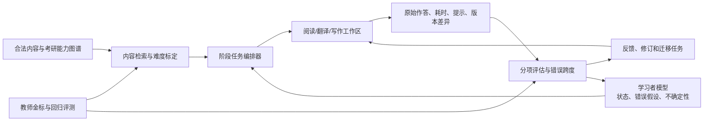

# 读写能力技术研究与落地框架

> 状态：产品发现阶段研究稿；更新日期：2026-07-15。本文讨论能力模型、训练闭环、技术边界和验证方法，不包含编码方案。

> 当前执行约束：受资源条件限制，本文中的教师共创、人工闭环、金标双评和 6–8 周试点暂不执行，均保留为未来证据门槛。当前只允许用合法样例、合成边界场景和自动回归验证工程契约，不据此宣称学习效果或评分效度。

## 1. 结论先行

如果目标是把考研英语读写能力做到极致，产品核心不应是聊天、万能答疑或一次性作文批改，而应是一个持续收集证据的训练系统：

`未辅助作答 → 定位证据和错因 → 只给当前所需脚手架 → 用户修订/重做 → 换材料迁移 → 延迟复测 → 更新学习者模型`

最重要的五个判断：

1. **阅读和写作不能分别做成两个工具。** 同一批词汇、词组、语法结构和篇章方法必须沿“读懂—译出—受控表达—独立写作”迁移。
2. **内容匹配不能只有一个难度分。** 词汇覆盖、目标词义、句法、篇章结构、推理跨度、主题背景、输出长度和限时压力需要分别建模。
3. **反馈价值由后续修订和新任务表现决定。** 反馈看起来详细、作文当场变好，不等于用户学会；必须记录是否采纳、是否改对、能否在新题中独立使用。
4. **自动评分必须表达不确定性。** 当前模型在词句层面较强，在篇章连贯、论证和真实高风险评分上仍与人类存在差距；不能只输出一个伪精确分数。
5. **产品壁垒不是接入某个大模型。** 真正的壁垒是考研英语能力图谱、带证据的学习者模型、合法高质量内容、版本化作品与修订数据、题型特化流程和长期效果评测。

前沿研究能够支撑其中的若干方法，但目前没有论文可以直接证明“某种 LLM 方案能长期提升中国考研英语分数”。所有邻近证据都需要在目标人群、英一/英二材料和 6–12 周周期中重新验证。

## 2. “读写能力”必须拆成什么

### 2.1 阅读能力向量

| 维度 | 要观察的能力 | 不能使用的替代指标 |
|---|---|---|
| 词汇与词组 | 目标考义、熟词僻义、搭配、指称、跨语境识别 | 只看背词 App 的“已学” |
| 句法处理 | 找主干、识别从属关系、省略、非谓语、修饰范围 | 只会说语法术语 |
| 篇章结构 | 段落功能、衔接、论证关系、作者立场 | 只做逐句翻译 |
| 证据推理 | 事实、指代衔接、跨句桥接、隐含推断、主旨 | 只记录选择题对错 |
| 干扰项辨析 | 偷换概念、范围变化、因果倒置、无据推断 | 记住真题答案 |
| 效率与执行 | 首读路径、回文策略、单位时间正确率、稳定性 | 单纯追求速度 |
| 迁移与保持 | 未见主题、未见文章、延迟后仍能完成 | 重做原文正确 |

### 2.2 写作能力向量

| 维度 | 要观察的能力 | 训练证据 |
|---|---|---|
| 任务完成 | 审题、对象、目的、信息点、文体 | 审题清单与初稿 |
| 内容 | 观点、例证、展开、信息完整性 | 段落功能与内容修订 |
| 组织 | 全文结构、段落推进、衔接和重点 | 提纲—初稿—修订差异 |
| 语言准确 | 语法、拼写、词形、搭配、指代 | 错误跨度与独立改正 |
| 语言范围 | 句式变化、词组储备、表达精度 | 新题中的自然使用 |
| 语域 | 正式程度、礼貌、立场强度、体裁适配 | 换对象/换目的改写 |
| 修订能力 | 能否理解反馈、判断优先级并真正改善 | 采纳率、修订成功率 |
| 限时执行 | 计划、成稿、检查和稳定性 | 未辅助限时作品 |

### 2.3 翻译是读写之间的桥

考研英译汉不应只给参考译文。至少拆成：源句理解、结构切分、逻辑关系恢复、信息完整、关键词义、中文自然度和限时表现。系统应允许多个正确表达，只标出具体错误跨度及其严重性，避免把“与参考答案措辞不同”误判为错误。

## 3. 必须解决的十四个产品问题

| 问题 | 失败表现 | 产品要求 |
|---|---|---|
| 能力构念是否正确 | 只刷正确率，无法解释为什么错 | 每道任务绑定词汇、句法、篇章、推理或表达目标 |
| 内容是否真匹配 | 同一“中级”材料对词汇合适、对句法却过难 | 使用多维难度向量，不用单一等级 |
| 是否有自然材料 | 为塞入目标词而生成生硬文章 | 合法内容检索优先，受控改写其次，自由生成最后 |
| 外部词汇能否迁移 | 认识词义，但在阅读、翻译、作文中不会用 | 按目标词义安排跨语境再遇与输出验证 |
| 语法能否进入篇章 | 会拆句，仍看不懂论证或不会写 | 语法节点必须通过改写、翻译和新篇章迁移点亮 |
| 错因是否可靠 | 猜对被判会了，同错被归为同一原因 | 记录答案、证据位置、耗时、提示、信心和后续反证 |
| 反馈是否过载 | 一次指出几十个问题，用户只复制答案 | 每轮只处理 1–3 个最高价值问题，分轮修订 |
| AI 是否替用户完成 | 成品更漂亮，独立能力不变甚至下降 | 先独立输出；默认给线索和局部示例，不直接整篇重写 |
| 评分是否可信 | 同文不同分、篇章误判、对低水平学习者不公平 | 分项评分、证据引用、置信区间、拒判和人工金标 |
| 修订是否产生学习 | 当次改对，新题仍错 | 记录修订采纳、修订成功、换题迁移和延迟保持 |
| 训练是否连贯 | 每天随机文章、随机作文、随机单词 | 用周级内容主线串联阅读、翻译和写作 |
| 是否符合英一/英二 | 通用英语练习与考场要求脱节 | 中期建能力，后期按试卷和题型切换任务配置 |
| 内容与数据是否合法 | 真题、范文、例句来源不清 | 每个内容单元保存权利、来源和版本 |
| 模型升级是否破坏质量 | 更换模型后评分和任务难度漂移 | 固定回归集、版本审计和逐步放量 |

## 4. 推荐的系统边界

### 4.1 确定性层

- 英一/英二阶段、题型、时间和流程规则；
- 内容权利、版本、答案和评分量表；
- 学习证据强度、复习窗口和阶段退出门槛；
- 防止提前展示答案、整篇代写和原题记忆污染的规则。

### 4.2 模型适用层

- 从内容库召回适合当前知识状态的候选材料；
- 估计词汇、句法、篇章与推理难度；
- 在严格约束下生成或改写候选题、提示和局部练习；
- 找出作文/翻译中的证据跨度，按量表生成候选诊断；
- 总结可被验证的错误假设；
- 根据修订结果生成下一次迁移任务。

### 4.3 模型不得单独决定

- 高风险总分和“预计提分”；
- 用户是否稳定掌握某能力；
- 自动生成内容是否可直接进入正式题库；
- 篇章级反馈是否一定正确；
- 某个反复错误是否是用户永久特征。

## 5. 阅读训练引擎

### 5.1 材料难度使用向量，不使用单分数

建议至少保存：

- 词汇覆盖率、低频词、熟词僻义、目标词密度；
- 句长、从句深度、非谓语、省略、指代距离；
- 连接关系、段落功能、论证抽象度；
- 回答问题所需的证据跨度和推理类型；
- 主题背景知识、文本长度、题型和限时；
- 对该用户而言材料是否见过、是否包含最近学习内容。

传统可读性公式或 CEFR 标签只能作为特征之一。2025 年的 ReadCtrl 表明近连续可读性控制在生成质量上可行，但这不等于生成材料已经适合考研教学，更不证明学习效果；正式使用仍需事实、自然度、能力目标和难度校准。

### 5.2 内容生产顺序

1. 从有权使用、经审核的材料中检索自然匹配内容；
2. 对候选材料做轻量标注或局部适配；
3. 在无法满足目标时受控生成候选材料；
4. 通过事实一致性、目标覆盖、难度、自然度和教师审核后入库；
5. 线上只从已通过相应质量等级的内容中编排。

不要在用户每次训练时无审核地实时生成整篇阅读和答案。

### 5.3 词汇再遇不是“重复出现”这么简单

2023 年二语附带词汇学习元分析显示，意义导向输入能产生词汇收益，但延迟测试中学会的目标词比例通常仍低于 20%，且受学习者水平、材料、间隔和测试方式影响。2026 年一项 124 名日本英语学习者研究进一步发现：跨主题/体裁的高语境多样性有利于较高词汇水平学习者的延迟词义识别，却可能不利于较低词汇水平者。

因此采用分层语境调度：

- 基础较弱或词义刚接触：先在相近主题和清晰语境中稳定目标义；
- 已能稳定识别：再改变主题、搭配、句法和体裁；
- 值得主动使用的词组：进入翻译、限定改写和作文；
- 仅用于阅读识别的词：不强迫写进作文；
- 每次出现记录语境距离、是否提示和结果，而不是只累计次数。

### 5.4 问题必须带“诊断标签”和证据链

阅读问题至少区分：

- 字面事实；
- 指代/省略衔接；
- 跨句桥接；
- 文本连接与论证关系；
- 背景补全；
- 主旨、态度和目的；
- 干扰项错误机制。

2025 年 BEA 研究中，GPT-4o 生成的题目有 93.8% 被专家判断为总体可用，但只有 42.6% 准确命中指定推理类型。这说明“大模型会出看起来不错的题”不等于“它能稳定出指定诊断题”。每个候选题都必须校验正确答案、最小证据跨度、干扰项唯一错误原因和诊断标签。

### 5.5 一次完整阅读任务

1. 未辅助首读并记录时间、答案和信心；
2. 标出支撑答案的原文证据，不先看系统摘要；
3. 对错误或低信心项做最小提示；
4. 重建句法、指代或论证链；
5. 用同一知识完成短翻译、改写或段落表达；
6. 数日后在未见材料中验证同类能力。

2026 年一项 405 名中学生随机实验发现，单独使用 LLM 不如传统记笔记带来的理解与保持，二者结合优于只用 LLM。虽然场景不是考研英语，但足以形成护栏：系统不能先给摘要和答案；用户必须保留证据标记、结构笔记或自己的复述。

## 6. 写作训练引擎

### 6.1 核心不是批改，而是版本化修订

标准循环：

`审题 → 独立提纲 → 独立初稿 → 分项诊断 → 选择修订目标 → 用户修订 → 比较版本 → 解释改动 → 新题迁移 → 延迟复写`

eRevise+RF 在 6 名教师、406 名学生、3 所学校中部署，重点不是给一个总分，而是评估证据使用、抽取两个版本间的证据/推理修订并判断修订是否成功。它直接支持本项目保存完整版本、差异和修订结果，而不是只保存终稿。

### 6.2 反馈对象分四层

1. **关键语言错误**：改变意思、造成歧义或反复出现的语法/搭配；
2. **句间关系**：指代、衔接、逻辑跳跃和重复；
3. **段落功能**：主题句、展开、例证和收束；
4. **全文任务**：审题、体裁、立场、信息完整和结构。

每条反馈应包含：问题跨度、对应量表、影响、最小线索、用户要执行的动作和后续验证方式。默认不提供整段或整篇“更高级版本”。

### 6.3 反馈预算和阶段差异

- 初稿不急于给总分，优先处理审题、内容和结构；
- 第二轮处理高影响句法和搭配；
- 第三轮再做精炼、语域和限时检查；
- 每轮聚焦 1–3 个最有学习价值的问题；
- 基础阶段可以给更直接的局部纠错，成熟阶段更多使用定位、提问和比较；
- 冲刺阶段按英一/英二真实时长和评分功能收紧流程。

2025 年“Don’t Score Too Early”指出，为完整作文训练的评分模型不一定适合未完成草稿；另一项 2025 年二语写作研究发现，直接纠错比 AI 整体改写引发更深加工，且只有直接纠错在新作文中的目标语法准确性出现显著提升。产品由此不应把“AI 润色全文”作为默认教学方式。

### 6.4 自动评分必须是“分项 + 证据 + 不确定性”

建议输出：

- 每个分项的等级或区间，而非只有一个总分；
- 支撑判断的文本跨度和量表描述；
- 系统不确定的原因；
- 当超出校准范围、文本过短、疑似复制或评估器冲突时拒绝给确定分；
- 教师纠正入口及纠正后的模型/量表版本记录。

EssayJudge 对 18 个多模态大模型的实验显示，模型与人类在篇章级特征上仍有明显差距。2025 年 EMNLP 的不确定性校准研究表明，可用保序预测为作文评分附加具有覆盖保证的预测集合；这适合转化为“分数区间/拒判”，但论文使用公开英语作文语料，不能直接当作考研作文评分器。

### 6.5 真正的学习指标

- 反馈采纳率：用户是否处理了反馈；
- 修订成功率：处理后是否真的改善；
- 独立改正率：没有直接答案时能否改对；
- 新题迁移率：换主题、换体裁后是否仍会；
- 延迟保持率：7/21 天后能否复现；
- 未辅助限时质量：最后必须回到考场条件；
- 反馈误报率：正确表达被错误纠正的比例。

## 7. 读—译—写共用一条内容主线

中期不应每天随机换内容。建议以 3–7 天为一个内容主线：

1. 在匹配水平的完整文章中读懂目标词组、语法和论证；
2. 抽取少量高价值表达，判断其语义、搭配和语域；
3. 对关键句做结构恢复和英译汉；
4. 完成保持原意的受控改写；
5. 用同一功能表达完成段落；
6. 在新的考研题目中独立写作；
7. 延迟后在不同主题中再次使用。

同一词汇状态至少分为 `阅读识别`、`翻译处理` 和 `主动表达`。阅读中认识并不能自动提升写作状态；有提示写对也不能自动提升无提示状态。

## 8. 学习者模型如何支撑读写

除目标、学习时间、语言背景和显式偏好外，每个动态状态至少包含：

- 能力/知识对象和具体目标义；
- 原始证据、材料难度和是否见过；
- 对错、耗时、信心、提示等级；
- 阅读证据跨度或写作版本差异；
- 最近出现、跨语境和延迟结果；
- 当前状态、置信度和下一验证任务；
- 反复错误假设、支持证据和反证。

2025 年 CIKT 的“分析器—预测器”结构提供了一个值得试验的原则：学习者画像不能只要求可读，还要检验它是否提高对下一次表现的预测。如果一个画像字段长期不能改善难度选择、错误预测或任务编排，就不应继续保留或赋予高权重。CIKT 并非语言学习研究，因此只能作为架构启发，必须用本项目数据复验。

## 9. 英一/英二后期特化

共同能力在中期建立，后期切换为试卷和题型配置：

- **完形**：篇章约束、搭配、逻辑和时间收益；
- **传统阅读**：证据定位、推理类型、干扰项机制和限时；
- **新题型**：篇章结构、衔接线索和题型流程；
- **翻译**：按英一/英二材料与任务形态训练切分、完整和中文表达；
- **小作文**：对象、目的、信息点、语域和功能表达；
- **大作文**：审题、结构、论证、图/表/主题信息处理及模板迁移。

真题每一轮必须有不同目标：

1. 未见条件下限时完成；
2. 重建证据链和错误假设；
3. 精读、翻译和表达迁移；
4. 间隔后重做以检查流程稳定；
5. 用未见同类材料验证，防止把答案记忆当能力。

作文模板不按整篇背诵判断掌握，而按“功能块识别—无提示复现—换题改写—限时组合—自然度”逐级验证。

## 10. 技术成熟度与采用建议

| 能力 | 当前建议 | 原因 |
|---|---|---|
| 受权内容检索与依据引用 | 可进入 MVP | 可控、可审计，能降低自由生成风险 |
| 多维难度特征与小规模人工标定 | 可进入 MVP | 是匹配和效果评估基础 |
| 保存原始作答、提示和作品版本 | 可进入 MVP | 是修订学习和状态更新的必要数据 |
| 量表约束的错误跨度/分项反馈 | 小范围上线 | 词句层较可用，需金标回归与拒判 |
| 自动作文总分 | 只作低风险参考 | 篇章、偏差和跨题稳定性仍不足 |
| 可读性受控生成 | 教师审核试点 | 技术质量有进展，教育效果和考研适配未证实 |
| 自动生成指定诊断阅读题 | 候选生成 + 强校验 | 总体可用不代表诊断类型准确 |
| xCOMET 类翻译错误跨度 | 仅作辅助特征 | 面向机器翻译，不等于学习者翻译或考研评分 |
| 动态画像驱动下一题预测 | 研究试点 | 邻近知识追踪研究有希望，缺少本领域数据 |
| 全自动生成课程、评分并更新掌握 | 暂不采用 | 错误会形成闭环放大，缺乏直接长期证据 |
| 模拟学生替代真实试点 | 只用于压力测试 | 不能证明真实学习效果 |

## 11. 评测体系

### 11.1 离线金标集

建议在技术立项前建立四组版本化样本；数量是首轮建议值，可随教师一致性调整：

| 金标集 | 首轮建议 | 标注内容 |
|---|---:|---|
| 阅读材料与题目 | 300 个题目单元 | 多维难度、答案、证据跨度、推理类型、干扰项机制 |
| 学习者阅读轨迹 | 100 名用户的连续任务 | 错因、提示、时间、迁移和延迟表现 |
| 翻译 | 300 个作答 | 信息单元、错误跨度、严重性、可接受变体、中文质量 |
| 写作 | 300 个用户、每人至少 2–3 个版本 | 分项量表、反馈、修订类型、修订成功和新题迁移 |

关键样本至少双评；分歧较大的量表先修订，不要急于训练模型。金标集需覆盖英一/英二、不同基础、不同题型和常见边界表达。

### 11.2 离线指标

- 阅读：答案准确率、证据跨度一致性、诊断标签准确率、难度校准误差；
- 翻译：关键错误召回、正确表达误报、错误严重度一致性；
- 写作：分项与教师一致性、置信区间覆盖、正确表达误报、拒判质量；
- 学习者模型：下一任务表现预测、状态更新准确率、错误假设确认/推翻率；
- 内容：事实错误、自然度、权利状态、难度漂移；
- 公平性：不同基础、英一/英二、语言背景和任务长度下的误差差异。

### 11.3 在线学习效果

核心比较不是“使用前后分数”，而是相近训练量下：

- 未见、同难度材料的独立表现；
- 7/21 天保持；
- 写作新题盲评；
- 反馈后的修订成功与后续迁移；
- 单位有效训练时间的进步；
- 用户离开系统后能否在限时条件下独立完成。

推荐首个 6–8 周对照实验比较：普通解析/一次性批改，与“证据定位—限量反馈—用户修订—换题迁移”闭环。教师盲评，主要终点使用未见材料与新作文，不使用模型自评作为最终结果。

## 12. 论文证据与落地边界

证据等级仅表示对本项目决策的可依赖程度：

- **A**：元分析、随机实验或直接学习效果研究；
- **B**：真实部署或同行评审的教育实证；
- **C**：技术基准或邻近领域方法，需本项目复验；
- **D**：预印本、模拟或立场性工作，只作研究线索。

| 研究 | 等级 | 能支撑什么 | 不能推出什么 |
|---|:---:|---|---|
| [Webb, Uchihara & Yanagisawa：二语附带词汇学习元分析（2023）](https://www.cambridge.org/core/journals/language-teaching/article/how-effective-is-second-language-incidental-vocabulary-learning-a-metaanalysis/E38E3468FD2090B1FA3051051DE8E70C) | A | 意义导向输入有效；水平、材料、间隔和测量会调节结果 | 阅读再遇可以取代主动词汇学习 |
| [Oikawa & Uchihara：语境多样性与词汇学习（2026）](https://www.cambridge.org/core/journals/studies-in-second-language-acquisition/article/effects-of-contextual-diversity-on-incidental-vocabulary-learning/F83A1EB55404E2E07FDC1695B0BC2BAE) | A | 语境变化应随词汇水平分层 | 所有学习者都应尽快跨主题高多样重复 |
| [Effects of LLM use and note-taking on reading comprehension and memory（2026）](https://doi.org/10.1016/j.compedu.2025.105514) | A | 保留主动笔记/证据处理；避免只读 AI 总结 | 对考研英语长期提分已有直接证明 |
| [AI tutoring outperforms in-class active learning（2025）](https://www.nature.com/articles/s41598-025-97652-6) | A | 专家内容、结构化脚手架、自定步调的重要性 | 物理课短期结果可直接外推英语备考 |
| [Distinguishing performance gains from learning（2025）](https://www.nature.com/articles/s44159-025-00467-5) | B | 产品必须区分当场表现和真正学习 | 文章本身证明某个具体训练流程有效 |
| [LearnLM: Improving Gemini for Learning（2024/2025 修订）](https://arxiv.org/abs/2412.16429) | C | 教学行为应由明确教学属性和评测约束 | 专家偏好等同于学习效果或适合考研 |
| [ReadCtrl（2025）](https://aclanthology.org/2025.in2writing-1.3/) | C | 近连续可读性控制具备技术可行性 | 自动生成文本天然真实、自然且能提分 |
| [Automatic Generation of Inference Making Questions（2025）](https://aclanthology.org/2025.bea-1.31/) | B | 使用推理类型体系；自动出题必须有人/规则校验 | 总体好题率可以替代诊断标签准确率 |
| [eRevise+RF（2025）](https://aclanthology.org/2025.naacl-demo.18/) | B | 保存版本、抽取修订并评估修订是否成功 | 其 K–12 论证写作结果可直接外推考研作文 |
| [EssayJudge（2025）](https://aclanthology.org/2025.findings-acl.329/) | C | 作文评价要分词汇、句子和篇章层；篇章层仍是弱点 | 大模型已经可以独立承担高风险评分 |
| [Beyond the Score: Uncertainty-Calibrated LLMs for AES（2025）](https://aclanthology.org/2025.emnlp-main.992/) | C | 输出预测集合、校准和拒判，而非裸分 | 公开作文语料上的覆盖保证自动迁移到考研作文 |
| [Don’t Score too Early! Assessing Incomplete Essays（2025）](https://aclanthology.org/2025.bea-1.27/) | C | 草稿阶段与终稿评分应分离 | 其模型可直接用于本项目 |
| [Comparative effects of direct feedback and AI reformulation（2025）](https://doi.org/10.1016/j.system.2025.103765) | A | 谨慎使用全文改写；关注深加工与新作文迁移 | 一切直接反馈都优于所有生成式反馈 |
| [xCOMET（2024）](https://aclanthology.org/2024.tacl-1.54/) | C | 翻译反馈可采用句级质量 + 错误跨度 + 严重度 | 机器翻译指标等同于考研学习者评分量表 |
| [CIKT（2025）](https://aclanthology.org/2025.emnlp-main.975/) | C | 可解释画像应通过下一次表现预测持续校验 | 通用知识追踪结果直接证明语言学习状态准确 |
| [Evaluating LLM-Based AES: Accuracy, Fairness, and Validity（2025）](https://aclanthology.org/2025.aimecon-wip.9/) | C | 评分需检查人机分歧和英语学习者公平性 | 提示优化后即可替代人工评分 |

## 13. 90 天研究与产品验证顺序

### 第 1–3 周：定义构念和金标规范

- 与考研教师冻结阅读、翻译和写作能力向量；
- 标注首批真实作答和可接受变体；
- 建立错误跨度、修订类型和证据链规范；
- 确认内容权利和真题使用路径。

### 第 4–6 周：人工闭环原型

- 不开发自动评分，先由教师人工执行完整闭环；
- 比较一次性解析/批改与多轮修订；
- 验证用户是否愿意标证据、修改并完成换题任务；
- 记录每名用户的人工编排时间和最有价值的自动化点。

### 第 7–10 周：影子评测

- 让候选模型在后台生成难度、错因和反馈，但不直接影响用户；
- 与教师金标比较词句层、篇章层和不同基础人群误差；
- 建立拒判阈值和回归集；
- 只放出已达到门槛的低风险反馈。

### 第 11–13 周：6–8 周试点准备

- 冻结实验协议、主要终点和盲评方式；
- 预注册未见材料、延迟复测和新作文评价；
- 确认英一/英二样本分层；
- 达不到金标一致性、内容权利或人工闭环正向信号时，不进入自动化开发。

## 14. 进入正式产品自动化开发前的硬门槛

- 教师对主要能力标签和量表具有可接受一致性；
- 人工闭环比一次性解析/批改产生更好的修订或迁移信号；
- 内容难度能在真实用户中校准，而不只依赖公式或模型；
- 自动反馈能引用正确跨度，正确表达误报处于可接受范围；
- 篇章级不确定样本能够拒判或转人工；
- 学习者模型的关键字段能实际改变并改善任务选择；
- 未见材料、延迟保持和限时独立输出已经进入评测协议；
- 任何自动化失败都不会替用户完成、污染掌握状态或泄露真题答案。

在这些门槛之前，最值得投入的不是训练专用大模型，而是教研定义、真实连续作答数据、人工闭环原型和高质量评测集。范围受限的技术 Spike 可按[技术 Spike 章程](19-技术Spike章程与开工门槛.md)验证工程命题，但不能据此关闭本节任何真人、教师或教学效度门槛。
