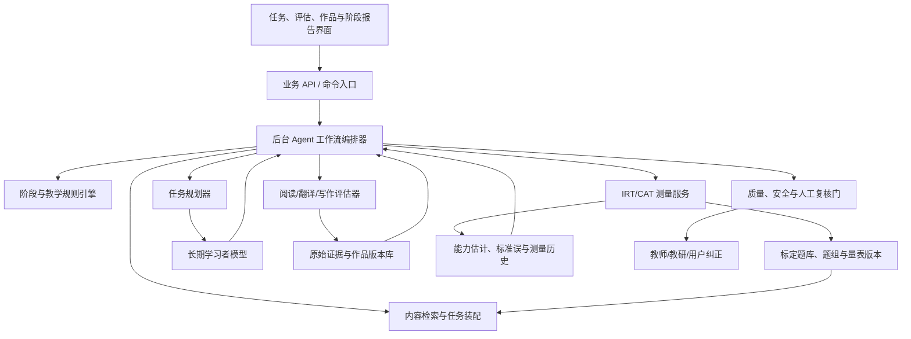

# 后台 Agent 与 IRT/CAT 技术路线

> 状态：技术预研与立项输入；更新日期：2026-07-15。本文只定义架构、测量边界、验证顺序和候选技术，不代表已经实现，也不包含业务代码。

> 当前执行约束：真人作答、教师标注和人工训练实验暂不具备条件。现阶段只实现工作流、数据契约、控制舱和离线模拟骨架；IRT/CAT、开放题自动评分和稳定能力判断保持影子或禁用状态，不从合成数据推出正式量尺结论。

## 1. 决策摘要

本项目应增加 Agent 技术路线和 IRT/CAT，但二者承担不同责任：

- **后台 Agent**：在三阶段规则内读取学习者状态，编排完整任务，调用内容、评估和测量工具，收集学习证据，并处理失败、低置信度和人工复核。
- **IRT**：题目反应理论（Item Response Theory，中文常译“项目反应理论”）用于建立能力参数与题目参数之间的测量模型。
- **CAT**：计算机化自适应测验（Computerized Adaptive Testing）根据当前能力估计和测量不确定性选择下一道题或下一组题，用更短测验取得足够精度。

两条最重要的边界：

1. **CAT 是测量系统，不是教学编排系统。** 它优化的是测量信息，不是学习收益；日常训练任务仍由阶段目标、局部知识状态、错误假设、迁移和复习共同决定。
2. **Agent 不得凭语言模型判断直接改写 IRT 能力值。** 只有来自已标定题目、可比较施测条件和合格评分器的作答，才能进入 IRT/CAT 测量更新。

推荐架构不是多个 Agent 自由协商，而是：

> 一个可持久化的受约束工作流编排器 + 多个类型明确的确定性/模型工具 + 独立的 IRT/CAT 测量服务。

Anthropic 对生产 Agent 的总结区分了预定义代码路径的 workflow 与模型动态决定过程的 agent，并建议从最简单、可组合的模式开始。考研英语的阶段、考试配置、证据强度和退出门槛明确，因此应以工作流为骨架，只在无法预先穷举的局部决策中开放有限自主性。[Building effective agents](https://www.anthropic.com/engineering/building-effective-agents)

## 2. 总体技术架构

### 2.1 三种状态必须分开

| 状态 | 生命周期 | 内容 | 不能混入什么 |
|---|---|---|---|
| 工作流运行状态 | 一次任务或训练周期 | 当前节点、待调用工具、重试、预算、检查点 | 长期用户画像 |
| 长期学习者模型 | 跨任务、跨阶段 | 目标、时间、偏好、局部状态、错误假设、证据引用 | Agent 临时推理文本 |
| IRT 测量状态 | 某量表版本内 | θ 后验、标准误/可信区间、已答标定题、停止原因 | 未标定练习的普通对错 |

LangGraph 官方文档将线程内 checkpoint 与跨线程 store 分开：前者适合运行恢复和短期状态，后者适合用户事实与长期记忆。这种分离与本项目需要一致，可作为候选运行时，但应在技术立项时与 Temporal、Inngest 或自建状态机比较，不在本阶段锁定框架。[LangGraph persistence](https://docs.langchain.com/oss/python/langgraph/persistence)

## 3. 后台 Agent 技术路线

### 3.1 Agent 在这里是什么

它不是聊天机器人，也不是在前台扮演老师。它是后台的状态化任务执行者：

`观察状态 → 选择允许的下一动作 → 调用工具 → 校验结果 → 写入证据 → 决定继续、暂停或转人工`

用户看到的是阶段计划、评估题、完整训练、作品修订和进步报告；不需要看到开放式对话界面。

### 3.2 推荐：单编排器，不做多 Agent 群

第一版只使用一个工作流编排器，把下列能力做成有严格输入输出的节点或工具：

| 模块 | 类型 | 主要职责 |
|---|---|---|
| 阶段管理器 | 确定性规则 | 前期/中期/后期状态与进入退出条件 |
| 测量路由器 | 规则 + IRT/CAT | 判断何时需要评估、继续还是停止 |
| 任务规划器 | 规则优先、模型辅助 | 把阶段目标、时间和知识缺口形成周期任务 |
| 内容检索器 | 检索/排序 | 从合法内容库召回候选材料 |
| 任务装配器 | 规则 + 受控生成 | 组合材料、题目、输出和迁移步骤 |
| 阅读诊断器 | 规则/模型组合 | 证据跨度、推理类型和错误机制 |
| 翻译/写作评估器 | 多评估器组合 | 分项、错误跨度、不确定性和修订目标 |
| 学习者模型更新器 | 证据规则 + 模型候选 | 更新局部状态，创建/验证错误假设 |
| 质量门 | 确定性规则 + 审核 | 拒绝低置信度、权利不明或越界输出 |
| 调度器 | 确定性规则 | 复习、延迟验证、阶段检查和通知 |

不把每个模块包装成一个会自由对话的 Agent。只有当未来实验证明某类任务需要不同权限、独立上下文和可分别评测的长流程时，才拆分子 Agent。

### 3.3 两层控制

#### 外层：确定性状态机

负责：

- 三阶段和英一/英二配置；
- 每个任务允许的节点与最大循环次数；
- 不先给答案、不整篇代写、评分低置信度拒判；
- 训练量、时间预算、模型成本和超时；
- 工具权限、数据访问范围和人工复核；
- 幂等、重试、失败补偿和版本记录。

#### 内层：有限模型决策

只处理：

- 多个合格材料中哪个更适合当前错误假设；
- 如何将反馈压缩为当前最重要的 1–3 项；
- 怎样生成符合明确约束的候选迁移任务；
- 哪些新错误可能构成待验证假设；
- 当规则无法区分时给出带理由的候选方案。

模型输出必须是结构化候选结果，由规则、验证器或人工复核后才能改变长期状态。

### 3.4 关键工作流

#### A. 前期熟悉与评估

`读取目标/时间/背景 → 选择测量蓝图 → CAT/MST 施测 → 加入翻译与写作锚定任务 → 形成初始画像 → 用户/教师校准 → 生成中期路径`

#### B. 中期周任务

`读取本周目标 → 检查到期复习和最近词汇 → 检索内容主线 → 装配读—译—写任务 → 质量门 → 发布 → 收集版本与提示 → 更新证据 → 安排新材料迁移`

#### C. 写作多稿修订

`独立初稿 → 分项评估 → 反馈优先级 → 用户修订 → 版本差异和修订成功 → 换题迁移 → 延迟复写`

#### D. 阶段切换

`检查阶段证据 → 若不确定则触发短 CAT/MST 或锚定任务 → 计算准备度 → 规则判断 → 必要时人工复核 → 切换题型配置`

### 3.5 暂停与人工介入

以下情况必须暂停，不允许 Agent 自行猜测：

- 生成内容事实、答案或版权状态不确定；
- 自动写作/翻译评分器冲突或超出校准范围；
- IRT 模型拟合、量表版本或题目参数异常；
- 阶段切换会显著改变用户计划，但证据不足；
- 用户纠正学习者画像或质疑关键错误假设；
- 即将发布新生成题、范文、评分量表或高风险报告。

支持持久化 checkpoint、暂停、审查、修改状态后恢复，是选择 Agent 运行时的必要条件。LangGraph 提供 durable execution、interrupt 和状态恢复，可作为实现候选而不是既定依赖。[LangGraph overview](https://docs.langchain.com/oss/python/langgraph/overview)、[Interrupts](https://docs.langchain.com/oss/python/langgraph/interrupts)

### 3.6 Agent 可观测性和评测

每次运行至少记录：

- 工作流版本、提示版本、模型与参数；
- 输入学习者快照和引用的证据；
- 每个节点、工具、参数、结果和耗时；
- 规则拒绝、模型冲突、重试和人工修改；
- 长期状态更新前后差异；
- 最终任务是否产生修订、迁移和延迟进步。

不能只评最终输出。至少建立三层评测：

1. **单节点**：工具与参数是否正确；
2. **轨迹**：是否按允许路径执行、是否调用了不必要工具；
3. **结果**：任务质量、状态更新和真实学习效果。

LangSmith 的官方评测文档也将 Agent 评测拆为 final response、single step 和 trajectory；本项目即使不采用该产品，也应保留这三个层次。[Agent evaluation approaches](https://docs.langchain.com/langsmith/evaluation-approaches)

## 4. IRT/CAT 在项目中的正确位置

### 4.1 最适合的场景

| 场景 | 是否使用 CAT | 说明 |
|---|---|---|
| 前期初始能力定位 | 是 | 用较短测验确定阅读/语言基础大致区间和不确定性 |
| 中期阶段检查 | 是 | 使用锚定题或题组比较同量尺变化 |
| 后期题型准备度分类 | 是/可用 MST | 判断是否进入题型强化或仍需基础补足 |
| 日常学习内容选择 | 否 | 优化目标是学习，不是最大化测量信息 |
| 外部背词记录同步 | 否 | “已学”不是标准化作答证据 |
| 作文每次批改 | 暂不直接 CAT | 自动评分误差和题目差异需单独建模 |
| 真题重做 | 通常不进入 IRT | 材料已见造成参数和能力估计污染 |

### 4.2 CAT 不等于自适应学习

CAT 通常倾向选择在当前 θ 附近信息量最大的题目；这可能连续给用户难度相近、诊断价值高但教学价值有限的题。训练引擎还必须考虑前置知识、内容连贯、间隔复习、语境迁移、写作输出和挫败负荷。

因此：

- CAT 给出“我们对能力知道多少”；
- 学习者模型给出“用户会什么、可能为什么错、证据有多强”；
- Agent 决定“下一阶段为了进步应该做什么”。

## 5. 能力量尺与题目单元

### 5.1 不要一开始建一个“英语总 θ”

建议第一阶段分模块建立量尺：

- `theta_language_foundation`：词汇目标义、搭配、核心语法等相对独立项目；
- `theta_reading`：完整篇章理解与推理；
- `theta_exam_execution`：只在后期通过限时组合任务补充，不与语言能力混成一个值。

翻译和写作先保留分项量表、作品版本和教师/自动评分不确定性。待评分稳定、任务数量和样本足够后，再研究 graded response、partial credit、many-facet Rasch 或联合人工—自动评分 IRT。

### 5.2 题目单元

| 内容 | 测量单元 | 初始候选模型 |
|---|---|---|
| 独立词汇/语法/短句项目 | 单题、二元得分 | Rasch/1PL 或 2PL |
| 阅读文章及其多道题 | 文章题组/testlet | 题组级 MST；后续 testlet/bifactor 模型 |
| 完形 | 完整篇章题组 | testlet 或篇章级模块，不简单当 20 道独立题 |
| 新题型 | 一组排序/匹配任务 | 部分计分或题组级任务 |
| 翻译 | 信息单元的多级得分 | Partial Credit/GRM，后续研究 |
| 写作 | 分项等级 + 评分者/评分器 | Many-facet/联合评分模型，后续研究 |

## 6. 为什么阅读更适合题组 CAT 或 MST

考研阅读的一篇文章共享主题、背景和语言输入，同篇题目之间通常存在局部依赖。忽略这种依赖会高估测量精度并使区分度估计偏差。

特别相关的是一项直接使用中国研究生入学英语考试阅读数据的研究：14,089 名考生、题组式阅读项目中，双因素模型和 testlet response theory 对局部依赖的处理优于普通单维 2PL/GR 模型。[Min & He, Language Testing](https://doi.org/10.1177/0265532214527277)

因此第一版推荐：

- 以文章/题组为自适应选择单位；
- 先使用两到三阶段的 MST：宽范围路由题组 → 低/中/高难题组 → 必要的确认题组；
- 每个模块满足题型、主题、词汇/句法覆盖和时间约束；
- 后续数据足够时比较 testlet、bifactor 和多维模型；
- 不对同篇文章的题目信息量简单相加。

PISA 阅读从 2018 年引入自适应测试，2022 年采用基于前序模块表现路由到不同难度 testlet 的多阶段设计，说明大型阅读测评也可优先采用题组级路由，而非强行逐题自适应。[PISA 2022 adaptive testing](https://www.oecd.org/en/publications/2023/12/pisa-2022-results-volume-i_76772a36/full-report/adaptive-testing-in-pisa-2022_21364c8d.html)

2026 年 testlet CAT 研究继续强调共享刺激导致的局部独立违背以及题组自适应设计的重要性；属于前沿方法线索，正式选型仍需本项目模拟。[Ersan & Rodriguez, 2026](https://doi.org/10.1080/15305058.2026.2630190)

## 7. IRT 模型采用顺序

### 阶段 0：没有真实标定数据

- 使用教师难度标签、经典测验指标和固定/分层测验；
- 记录原始作答、提示、时间、是否见过和评分版本；
- 不把模型或教师预测难度伪装成 IRT 参数；
- 用人工训练实验验证能力构念和题目蓝图。

### 阶段 1：基础 IRT 影子标定

- 独立二元题先比较 Rasch/1PL 与 2PL；
- 极端作答早期使用 EAP/MAP 后验估计，避免 MLE 无法稳定估计全对/全错；
- 检查单维性、单调性、局部独立、题目拟合和参数稳定；
- 检查不同英一/英二、基础分层和语言背景的 DIF；
- 通过共同锚题连接不同版本量尺。

除非样本和模型拟合明确支持，不直接采用 3PL。四选一存在猜测不代表现有数据足以稳定估计每题猜测参数。

### 阶段 2：CAT/MST 影子运行

- 系统后台计算下一题/题组，但用户仍完成固定或分层测验；
- 比较自适应估计与完整测验、教师判断和后续表现；
- 模拟题库覆盖、极端能力、曝光率和停止规则；
- 达到预设等值、偏差和公平性门槛后，小流量上线。

### 阶段 3：题组与多维模型

- 阅读比较 testlet、bifactor、MIRT 和 MST；
- 翻译/写作研究 polytomous 与评分者模型；
- 仅在真实数据证明收益时使用认知诊断或神经 CAT；
- 保留传统 IRT/MST 作为可解释基线。

## 8. CAT 核心算法组件

一次 CAT/MST 运行至少包含：

### 8.1 初始化

- 默认使用同量尺人群先验；
- 可用历史锚定测量结果作为先验，但必须考虑时间衰减和量表版本；
- 用户自报成绩只用于宽范围路由，不能充当强测量证据；
- 也可先给覆盖广的短路由模块，避免背景信息造成自证偏差。

### 8.2 选择

最大化信息量只是候选排序的一部分，还必须同时满足：

- 内容蓝图和题型覆盖；
- 文章/testlet 完整性；
- 主题与材料重复限制；
- 题目曝光控制和安全；
- 已见、冲突、互相提示的 enemy items；
- 预计时间和无障碍要求；
- 英一/英二适用配置。

CAT 的经典项目选择可以拆为内容平衡、选择准则和曝光控制三个组件。[Han, 2018](https://pmc.ncbi.nlm.nih.gov/articles/PMC5968224/)

### 8.3 更新

每次作答后保存：

- θ 的点估计；
- 后验分布或标准误/可信区间；
- 使用的量表、模型和题目参数版本；
- 作答是否有效、是否受提示、是否见过；
- 异常反应和响应时间信号。

响应时间可以作为异常检测或考试执行证据，但不应未经验证直接并入语言能力 θ。

### 8.4 停止

不能只设“答满 N 题”。推荐组合规则：

- 已达到目标标准误或可信区间宽度；
- 已满足最低内容蓝图；
- 已达到阶段准备度分类的置信要求；
- 同时设置最短和最长测验长度；
- 题库在当前能力区间信息不足时停止并报告“不确定”，不能无限出题。

最终输出必须包含估计区间、测量日期、量表版本、覆盖范围和停止原因。

## 9. Agent 与 CAT 的交互协议

### 9.1 Agent 可以向 CAT 请求

- 目标量尺和测量目的：定位、精度估计或阶段分类；
- 英一/英二和内容蓝图；
- 最大时间/题组数；
- 已见材料和不可使用题目；
- 允许使用的历史先验版本。

### 9.2 CAT 只返回

- 下一道标定题或下一题组 ID；
- 当前 θ 后验、标准误/区间；
- 蓝图覆盖和剩余缺口；
- 停止/继续建议与确定性原因；
- 异常、题库不足或量表失配状态。

CAT 不生成教学解释，不创建错误假设，也不选择作文反馈。

### 9.3 Agent 消费测量结果时

- 将 θ 和区间视为一类证据，不覆盖细粒度知识状态；
- 区间很宽时安排进一步测量，而不是假装精确；
- 测量结果与真实任务持续冲突时，标记量表漂移、DIF、题目泄露或模型失配；
- 阶段切换同时考虑 CAT、未见任务、文字作品、时间和错误假设；
- 所有决策记录使用了哪个测量版本和怎样影响后续任务。

## 10. 写作、翻译与自动评分误差

开放作答进入 IRT 时不能把自动评分当成无误真值。2025 年 Psychometrika 研究指出，自动评分分类误差会使按人工得分建立的测量模型失配，并提出人工—自动分数联合模型；PISA 阅读开放题和模拟结果显示，显式建模评分误差可减轻能力估计偏差。[Joint Item Response Models](https://www.cambridge.org/core/journals/psychometrika/article/joint-item-response-models-for-manual-and-automatic-scores-on-openended-test-items/FE2D892AB16F10705B6099D4151A6F90)

本项目采用顺序：

1. 先建立分项量表、教师双评和自动评分误差矩阵；
2. 自动评分只提供带置信度的 provisional score；
3. 低置信度和量表关键样本转人工；
4. 数据足够后研究联合评分误差模型；
5. 未证明跨题稳定前，作文/翻译不参与实时 CAT 路由。

2025 年 EFSET 工作展示了使用 LLM 生成写作题、模拟回答和训练自动评分器的完整管线，但作者也明确承认合成数据可能强化偏差，新题池仍需要大规模心理测量分析和持续人工审核。本项目可借鉴“候选生成—专家筛选—真实数据标定”，不能把合成回答当成正式 IRT 标定数据。[Adaptive English Writing Assessment](https://aclanthology.org/2025.bea-1.73/)

## 11. 数据模型增量

### 11.1 Agent 运行

- `workflow_definition_version`；
- `workflow_run_id`、`checkpoint_id`、`node_id`；
- `learner_snapshot_id`；
- `tool_name`、`tool_input`、`tool_output_ref`；
- `prompt/model/rule/rubric/content_version`；
- `retry_count`、`latency`、`cost`；
- `decision_reason`、`confidence`；
- `interrupt_reason`、`review_action`；
- `state_diff` 与写入证据 ID。

### 11.2 IRT 题库

- `item_id`、`testlet_id`、`passage_id`；
- 能力构念、题型、英一/英二配置和内容标签；
- 评分类型与评分器版本；
- `a/b/c` 或对应模型参数及标准误；
- testlet/局部依赖参数；
- 标定样本、拟合、DIF 和参数漂移状态；
- 锚题、量表版本和等值关系；
- 曝光率、使用上限、enemy items；
- 权利、发布日期、泄露/退役状态。

### 11.3 CAT 施测

- `administration_id`、目的和蓝图；
- 起始先验及来源；
- 每一步候选集、选择结果与约束；
- 反应、得分、耗时和有效性；
- 每一步 θ 后验与标准误；
- 停止规则、停止原因和题库缺口；
- 最终区间、量表版本和后续决策引用。

## 12. 前沿技术：可以研究，但不应直接生产化

| 方向 | 近期证据 | 本项目态度 |
|---|---|---|
| AutoIRT | 使用题目语言特征与 AutoML 辅助参数预测，并在 Duolingo English Test 等场景研究 | 可用于冷启动先验/候选排序，不能代替真实作答标定 |
| BanditCAT | 2025 年结合贝叶斯更新、Fisher 信息、Thompson sampling 和曝光随机化 | 影子实验，对照经典信息量选择 |
| Deep CAT / 强化学习选题 | 2025 年研究多维潜变量与 deep Q-learning | 仅研究；可解释性、数据量和策略漂移风险较高 |
| Fast Adaptive Cognitive Diagnosis | 2025 年使用响应图快速形成认知画像 | 可作为局部知识诊断对照，不替代 IRT 量尺 |
| LLM 自动出题和模拟学生 | 语言测评已出现完整管线 | 只生成候选；真实人类标定、DIF 和审核不可省略 |
| 练习中隐式测量 | 研究尝试从日常练习估计语言能力 | 只有满足标定和施测条件的练习可进入测量，普通训练证据仍分开 |

来源：[AutoIRT](https://arxiv.org/abs/2409.08823)、[BanditCAT and AutoIRT](https://proceedings.mlr.press/v264/sharpnack25a.html)、[Deep Computerized Adaptive Testing](https://arxiv.org/abs/2502.19275)、[FACD](https://www.ijcai.org/proceedings/2025/648)、[Implicit assessment during practice](https://arxiv.org/abs/2409.16133)。

## 13. 分阶段落地路线

### Phase A：架构与测量准备，不写 CAT 生产功能

- 冻结 Agent 状态图、工具契约和版本字段；
- 由教师定义能力构念、题目蓝图和评分量表；
- 建立题目/testlet 元数据和合法内容库；
- 收集固定测验与连续训练数据；
- 建立 Agent 单节点、轨迹和结果评测集。

### Phase B：人工/规则工作流 MVP

- 使用确定性状态机执行三阶段和完整任务；
- 模型仅生成候选内容、诊断和反馈；
- 学习者模型更新保留证据和人工纠正；
- 评估仍用固定/分层测验；
- 后台拟合 IRT，但不影响真实用户路径。

### Phase C：CAT/MST 影子运行

- 对独立题运行 1PL/2PL 影子 CAT；
- 对阅读运行题组级 MST/testlet 模拟；
- 检查精度、题量、内容覆盖、曝光、DIF 和后续预测；
- 与固定测验、教师判断和未见材料表现比较。

### Phase D：小流量前期评估

- CAT 仅用于前期定位和中期阶段检查；
- 输出区间和不确定性，不输出“精确提分”；
- 设置固定回退测验；
- 监控参数漂移、曝光和人群误差。

### Phase E：扩展到开放作答和前沿模型

- 在自动评分误差可测、人工锚定稳定后研究翻译/写作 IRT；
- 比较 MIRT、认知诊断、BanditCAT 和神经 CAT；
- 只有当其在真实用户、真实量尺上优于简单基线时才采用。

## 14. 进入正式产品实现前必须回答

以下问题不阻止按[技术 Spike 章程](19-技术Spike章程与开工门槛.md)开展隔离的框架、恢复和回归对照；它们阻止未经验证的 Agent、IRT/CAT 和自动评分进入真人路径或用户可见决策。

### Agent

- 哪些节点必须确定性，哪些允许模型选择？
- 每个工具的输入、输出、权限和失败语义是什么？
- checkpoint 与长期学习者模型如何隔离？
- 什么情况暂停、拒判或转人工？
- 如何对单节点、轨迹和学习结果分别回归？
- 模型供应商变化时如何保持业务与测量稳定？

### IRT/CAT

- 每个 θ 对应的能力构念和使用决策是什么？
- 哪些题目满足同量尺、未见和可比较施测条件？
- 阅读采用 MST、testlet、bifactor 还是其他模型，模拟结果如何？
- 标定样本、题库覆盖和参数精度是否满足上线要求？
- 如何检查局部依赖、DIF、参数漂移、曝光和题目泄露？
- 停止规则是否同时满足精度、内容蓝图和最大负担？
- 自动评分误差如何进入开放题能力估计？
- CAT 失败或题库不足时怎样回退到固定测验？

## 15. 当前推荐结论

1. 把 Agent 技术路线正式加入项目，但定位为后台受约束工作流，不增加聊天产品形态。
2. 技术立项时优先验证 LangGraph 类低层运行时，因为本项目确实需要持久化、暂停恢复、人工复核和状态图；同时保留无框架/其他运行时对照。
3. IRT/CAT 首先服务前期评估和阶段检查，不接管中期训练推荐。
4. 阅读优先采用题组级 MST，再用真实数据比较 testlet/bifactor；这比直接做逐题 3PL CAT更符合考研阅读结构。
5. 作文和翻译暂不进入实时 CAT，先解决评分量表、自动评分误差和跨题稳定性。
6. AutoIRT、BanditCAT、认知诊断和神经 CAT放到影子研究层，始终保留简单、可解释的 IRT/MST 基线。
7. 在没有真实标定数据前，只建设数据结构和影子实验，不展示 IRT 能力值或自适应精度承诺。
