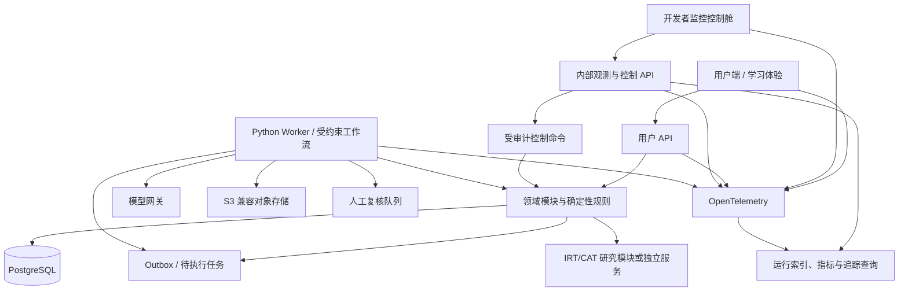

# 技术栈调研与架构选型

> 状态：技术立项输入 / 第一轮调研；更新日期：2026-07-15。本文给出可验证的候选方案和暂定结论，不代表系统已经实现。由于当前无法开展真人/教师人工验证，技术选型先通过工程 Spike 冻结；学习效果、评分效度和产品需求仍保持未验证状态。

## 1. 决策摘要

第一版推荐采用：

> **两套独立桌面 Web 前端 + Python 业务/Agent 后端 + PostgreSQL 单一事实源 + 模块化单体 + 独立 Worker。**

暂定技术组合：

| 层 | 暂定选择 | 状态 |
|---|---|---|
| 用户端 | 独立 Next.js 应用；只呈现学习任务、反馈与用户可理解的进步证据 | 已确定 |
| 开发者控制舱 | 独立 Next.js 应用；观测运行、处理复核并执行受审计控制 | 已确定 |
| 阅读/写作工作区 | Tiptap 3 / ProseMirror，自定义语义 Mark 与版本协议 | 必须先做 Spike |
| API 与领域服务 | FastAPI、Pydantic v2、SQLAlchemy 2、Alembic | 推荐 |
| Python 运行时 | Python 3.13；验证依赖后再升 3.14 | 推荐 |
| Node 运行时 | Node.js 24 LTS | 推荐 |
| 主数据 | PostgreSQL 18；托管平台若未就绪可用 17 | 推荐 |
| 文件/大对象 | S3 兼容对象存储 | 推荐 |
| 检索 | PostgreSQL 全文/结构化检索优先，pgvector 按评测后启用 | 推荐 |
| 后台执行 | 同一 Python 代码库中的独立 Worker + 数据库 Outbox | 推荐起点 |
| Agent 编排 | 显式状态机为业务真相；LangGraph 与 Temporal 做对照 Spike | 待冻结 |
| 缓存/限流 | Redis 仅在负载或队列方案证明需要时引入 | 延后 |
| 可观测性 | OpenTelemetry + 结构化日志 + 指标/追踪后端 | 推荐 |
| 测试 | pytest、Vitest、Testing Library、Playwright、版本化金标集 | 推荐 |
| 本地与交付 | pnpm + uv + Docker Compose；生产使用托管容器，不先上 Kubernetes | 推荐 |

这里的“双栈”不是微服务化。首版仍是一个仓库、一个主数据库和一个版本体系；两套前端分别构建和部署，但共享经过边界控制的后端领域能力。用户端与开发者控制舱不能只是同一应用中的两个菜单或两组路由。

## 2. 选型必须服务的产品约束

技术栈需要首先保证以下能力，而不是追逐框架热度：

1. **学习证据可追溯**：原始作答、提示、AI 介入、修订、迁移和延迟验证不能被派生状态覆盖。
2. **用户内容归属清楚**：用户原创、用户改写、AI 建议和系统参考内容必须能区分。
3. **受约束后台 Agent**：阶段、工具权限、最大循环、成本预算、拒判和人工复核由确定性规则控制。
4. **暂停、恢复与幂等**：模型超时、人工审核或用户稍后继续时，工作流不能从头猜测或重复产生副作用。
5. **内容权利可审计**：每个材料、题目、解析、范文和派生版本都能追到来源、授权与版本。
6. **模型可替换**：模型供应商变化不能直接改变业务数据结构、学习量尺或状态更新规则。
7. **桌面浏览器是唯一终端**：用户端与控制舱都只服务电脑浏览器，并以宽屏、鼠标、键盘、快捷键和长时间连续读写为设计前提。
8. **测量与教学隔离**：IRT/CAT 是独立测量边界，不直接接管日常教学编排。
9. **学习体验与技术运行隔离**：用户端不出现 Agent、模型、工作流、token、checkpoint、置信区间或内部错误等技术解释；开发者通过独立控制舱观察和控制系统。
10. **工程验证不能冒充效果验证**：合成场景、模型互评、开发者自测和自动回归只能证明系统按契约运行，不能证明真实用户会学习、迁移或长期保持。

## 3. 三条总体路线比较

评分为本项目当前阶段的相对判断，5 分最好。

| 方案 | 研发速度 | AI/测量生态 | 类型一致性 | 富交互前端 | 运维复杂度 | 总体判断 |
|---|---:|---:|---:|---:|---:|---|
| Next.js 全栈 TypeScript | 5 | 3 | 5 | 5 | 5 | 适合普通 SaaS，但后续心理测量、NLP 评测和 Python 研究代码迁移成本较高 |
| Next.js + FastAPI/Python | 4 | 5 | 3 | 5 | 4 | **推荐**；用 OpenAPI 契约和单仓库降低双语言成本 |
| React + Django/Python | 3 | 5 | 3 | 4 | 3 | 后台管理强，但当前核心不是传统 CMS；API 与交互工作区仍需额外拆分 |

不建议首版采用：

- 微服务、Kubernetes 或服务网格；
- 多 Agent 自由协商；
- 单独图数据库、向量数据库或 Elasticsearch；
- 为未来 CAT 预先建设实时测量集群；
- 手机、平板、原生桌面客户端、触控笔、语音、相机、OCR 或跨终端同步；
- 训练专用大模型或自建推理集群。

## 4. 推荐的逻辑架构



物理部署初期只需：

- `learner-web`：面向考生的 Next.js 用户端；
- `control-cockpit`：仅面向开发者和授权运维人员的 Next.js 监控控制舱；
- `api`：FastAPI；
- `worker`：与 API 共用 Python 领域包；
- `postgres`：托管 PostgreSQL；
- `object-storage`：托管或自建 S3 兼容存储；
- `otel-collector`：可按环境部署。

两套前端使用独立域名、独立构建产物、独立会话与独立权限策略。`api` 与 `worker` 是进程边界，不是两个独立业务系统。测量模块先以同仓库 Python package 和离线作业存在，只有在量表版本、计算资源或发布节奏确实独立后再拆服务。

## 5. 两套前端与学习工作区

### 5.1 双前端边界

| 前端 | 使用者 | 只负责 | 明确不负责 |
|---|---|---|---|
| 用户端 | 考研英语学习者 | 语境实验室、表达实验室、阶段进步、学习者模型查看与纠正 | 展示模型供应商、工作流节点、内部置信度、token、成本、追踪、队列和异常堆栈 |
| 开发者控制舱 | 开发、运维、数据/模型工程及经授权教研 | 系统健康、运行轨迹、人工复核、版本与成本观测、受审计控制 | 充当考生学习入口、绕过领域规则直接改库、默认暴露完整用户正文 |

两者可以共享设计令牌、无障碍基础组件和稳定领域术语，但不共享业务页面、权限判断或 API client。控制舱功能不得通过“隐藏按钮”埋在用户端构建产物中。

### 5.2 为什么只做桌面 Web

- 长文阅读、精确标记、关系解释、版本修订与连续写作需要稳定的大屏工作区，电脑浏览器最符合核心任务；
- 鼠标选择、键盘输入、中文输入法、快捷键和多栏布局可以被当作核心能力优化，而不受触控与窄屏兼容牵制；
- 浏览器交付保留快速迭代和统一发布的优势，同时不承担应用商店、原生客户端和多终端同步成本；
- 手机、平板、原生桌面客户端、触控笔、语音、相机、拍照/OCR、推送和跨终端接续均为明确排除项，不作为“以后再做”的默认路线；
- 首版不默认做离线缓存，避免敏感学习记录残留在共享电脑。

### 5.3 共享前端技术底座

| 能力 | 建议 |
|---|---|
| 路由与应用壳 | Next.js App Router |
| 组件 | React 19；Server Component 用于壳和只读页面，工作区使用 Client Component |
| 样式 | CSS Variables + Tailwind CSS；组件语义优先，不把视觉库当领域层 |
| 服务端状态 | TanStack Query 或等价轻量方案；API 返回值不复制进全局 Store |
| 表单 | React Hook Form + 由 OpenAPI/JSON Schema 派生的校验 |
| 编辑器 | Tiptap/ProseMirror |
| 测试 | Vitest + Testing Library + Playwright |

不在首版默认引入 Redux。只有当跨页面客户端状态无法由 URL、服务端状态和局部编辑器状态表达时，再增加全局状态库。

### 5.4 用户端：不出现技术相关解释

用户端只解释学习上发生了什么、为什么需要下一步，以及用户可以做什么。它不得展示：

- Agent、workflow、node、tool、checkpoint、queue 或 retry；
- 模型供应商、模型版本、提示词版本、token、调用成本或原始模型响应；
- IRT 的内部 `theta`、标准误、拟合状态或测量服务异常；
- 内部置信度数值、trace ID、日志、异常堆栈和数据库错误；
- “因为模型判断”“因为工作流失败”一类把技术机制当学习解释的文案。

内部状态必须翻译成学习者能采取行动的表达，例如：

| 内部状态 | 用户端表达原则 |
|---|---|
| 证据不足/低置信度 | “还需要一次新材料验证”，并给出下一步 |
| 自动评分冲突 | “这次反馈需要复核”，不展示模型争议细节 |
| 模型或工具暂时不可用 | 提供可继续的确定性任务或稍后重试，不解释供应商故障 |
| 工作流等待延迟验证 | 展示具体复习日期和任务目的，不展示 checkpoint |
| 阶段切换未通过 | 说明还缺哪类学习证据，不展示规则引擎或量尺参数 |

法律要求的 AI 内容标识仍需保留，但使用统一、简洁的产品语言，不展开实现方式。

首次用户路径固定为：最小背景设置 → 轻量阅读校准 → 自然语言画像摘要 → 第一篇匹配阅读。用户端提供“太难/合适/太简单”和“见过材料/误操作”等低成本纠偏入口；不得展示统一能力等级、内部置信度数值或匹配算法。完成首次校准后应直接进入材料，不以技术报告页截断价值体验。

该流程的页面状态、服务端完成事实、事件 schema、恢复/降级状态和控制舱看板见[首次体验页面状态与埋点清单](17-首次体验页面状态与埋点清单.md)。

### 5.5 开发者监控控制舱

控制舱不是通用日志面板的替代品，而是面向本产品工作流的观测与控制平面。第一版建议包含：

1. **系统总览**：API/Worker 健康、任务积压、错误率、延迟、模型调用量和成本预算；
2. **运行浏览器**：按用户匿名 ID、任务、工作流版本、状态和时间检索运行，查看节点、工具、输入输出摘要、重试与状态差异；
3. **人工复核队列**：评分冲突、低置信度、内容权利、阶段切换和用户申诉；
4. **版本观测**：模型、提示、规则、量表、内容与工作流版本的流量和回归结果；
5. **质量与评测**：金标集结果、拒判率、人群切片、内容错误和模型漂移；
6. **受控操作**：暂停、恢复、取消、有限重试、从 checkpoint 回放、批准/驳回候选更新、切换降级方案；
7. **安全开关**：按模型、工具、工作流或功能关闭流量，调整预算、并发和速率上限；
8. **审计记录**：谁在何时基于什么原因查看了敏感数据或执行了什么操作，操作前后状态是什么。

控制舱还需提供“校准与材料匹配”视图：按匿名用户或画像版本查看背景先验、局部能力估计、证据量、置信度、候选材料、过滤条件、排序理由、最终选择、用户难度反馈和后续纠偏。它用于发现材料普遍过难、单一维度错配、熟题污染和画像漂移；默认展示聚合与脱敏证据，不默认暴露完整作答正文。

控制舱所有写操作必须经过控制 API，禁止直接修改数据库。默认只读；高风险操作需要二次确认、操作理由、幂等键、乐观锁和完整审计。查看用户完整正文采用按需授权和脱敏默认值，不能因为是开发者工具就绕过数据最小化。

### 5.6 编辑器内核建议

Tiptap 基于 ProseMirror，支持自定义 node、mark、属性和命令；扩展名与属性可持久化到 JSON。ProseMirror 的不可变文档、transaction 和可回放 transform 也更适合记录修订过程。官方资料见 [Tiptap extensions](https://tiptap.dev/docs/editor/core-concepts/extensions)、[Tiptap extension API](https://tiptap.dev/docs/editor/extensions/custom-extensions/create-new/extension) 与 [ProseMirror guide](https://prosemirror.net/docs/guide/)。

但编辑器 JSON 不能直接成为唯一业务事实。建议同时保存：

- `document_json`：编辑器结构与自定义 mark；
- `plain_text`：规范化文本，用于评分、检索和 diff；
- `schema_version`：编辑器文档协议版本；
- `attempt_version_id`：不可变作品版本；
- `content_hash`：防止同一版本静默变化；
- `annotation`：引用版本、起止位置、原文片段哈希、标签、用户解释与创建者；
- `revision_event`：前后版本、变化跨度、对应反馈、修改主体和修订结果。

首个编辑器 Spike 必须验证：中文输入法组合态、英文输入、鼠标精确选区、重叠标记、复制粘贴清洗、撤销重做、版本 diff、5,000 词文档性能、桌面缩放、无障碍键盘操作和 JSON schema 升级。

## 6. 后端与领域边界

### 6.1 为什么选择 Python 后端

- Agent 工作流、NLP、自动评分、IRT/CAT 与数据分析最终都以 Python 生态为主；
- Pydantic 可把模型工具输入输出、API 契约和工作流状态定义为严格结构；
- FastAPI 原生生成 OpenAPI，便于前端生成类型客户端；
- 研究代码在达到门槛后可迁入生产领域模块，不需要跨语言重写核心算法。

FastAPI 官方说明其数据处理建立在 Pydantic 上，可由类型模型产生验证和 JSON Schema；版本升级应在测试通过后锁定实际使用版本，见 [FastAPI features](https://fastapi.tiangolo.com/features/) 与 [FastAPI versioning](https://fastapi.tiangolo.com/deployment/versions/)。

### 6.2 模块化单体边界

建议按领域拆包，而不是按控制器/模型/工具横切全仓库：

| 模块 | 责任 |
|---|---|
| `identity` | 用户、同意、授权、数据导出/删除请求 |
| `learner` | 显式输入、学习者快照、局部状态、错误假设 |
| `content` | 材料、题目、权利、版本、难度特征 |
| `training` | 阶段、任务模板、任务实例、提示与迁移安排 |
| `workspace` | 标注、作答、作品版本、AI 介入、修订事件 |
| `evidence` | 原始证据、证据等级、状态更新引用、IPE/SVPU |
| `workflow` | 运行、节点、checkpoint、outbox、复核与失败语义 |
| `evaluation` | 阅读/翻译/写作量表、候选诊断、拒判与金标 |
| `measurement` | 量表、题库参数、施测、IRT/CAT 影子结果 |
| `audit` | 规则/提示/模型/内容版本、决策与访问审计 |

模块只能通过明确的 application service 或事件契约交互。数据库可以共用，但禁止跨模块随意写表。

## 7. 数据技术路线

### 7.1 PostgreSQL 作为单一事实源

PostgreSQL 适合同时承载关系约束、事务、JSONB、全文检索、审计引用和后续向量扩展。官方当前版本为 18，主要版本提供约 5 年支持；生产应使用所选大版本的最新补丁，见 [PostgreSQL documentation](https://www.postgresql.org/docs/) 与 [versioning policy](https://www.postgresql.org/support/versioning/)。

建议数据策略：

- 原始证据与作品版本只追加，不原地覆盖；
- 派生的学习者快照可重算，并保存生成它的证据 ID、规则版本和模型版本；
- 高风险状态更新使用 `proposed → reviewed/accepted/rejected`，模型不能直接写最终状态；
- 业务事务与 Outbox 同事务提交，避免“数据已写但任务丢失”；
- 删除采用可证明的异步流程，同时处理主库、对象存储、缓存、备份策略和第三方处理者；
- 内容权利作为内容发布条件，而不是普通备注字段。

### 7.2 暂不引入专用检索系统

首版内容规模和检索需求尚未证明需要 Elasticsearch、图数据库或独立向量库：

1. 先用结构化标签、PostgreSQL 全文检索、trigram 和可解释排序；
2. embedding 只作为候选召回特征，不能越过权利、阶段、难度和已见材料过滤；
3. 需要语义检索时先在同库启用 pgvector，并以召回率、延迟和过滤正确性评测；
4. 只有规模与负载证明单库不足时再拆专用检索服务。

pgvector 官方支持精确检索及 HNSW/IVFFlat 近似索引，但近似检索需要持续监控 recall，见 [pgvector](https://github.com/pgvector/pgvector)。

## 8. Agent 与后台工作流选型

业务状态机必须先于框架存在。无论使用哪种运行时，以下内容都要由项目代码定义：

- 允许的状态与转换；
- 每个节点的输入、输出、权限与失败语义；
- 幂等键、重试边界和副作用；
- 模型预算、超时、拒判和人工复核条件；
- checkpoint 与长期学习者模型的隔离；
- 规则、提示、模型、量表和内容版本。

### 8.1 候选比较

| 方案 | 优点 | 风险 | 暂定位置 |
|---|---|---|---|
| 显式 Python 状态机 + PostgreSQL | 最透明、依赖少、便于领域测试 | 暂停恢复、回放和图调试需要自行实现 | 业务真相与基线 |
| LangGraph | LLM 工作流、checkpoint、interrupt、恢复和人工介入贴合需求 | 运行语义与存储增长需验证；不能把长期模型塞进 graph state | **优先 Spike** |
| Temporal | 长周期耐久执行、故障恢复和重试语义强 | 引入独立基础设施、学习和运维成本；对当前小规模 MVP 可能过重 | 中后期对照 |

LangGraph 官方文档说明 checkpointer 会保存每步图状态，并支持人工介入、回放和故障恢复；`interrupt()` 可持久化暂停并等待恢复，但恢复时节点会从头执行，因此前置副作用必须幂等，见 [persistence](https://docs.langchain.com/oss/python/langgraph/persistence) 与 [interrupts](https://docs.langchain.com/oss/python/langgraph/interrupts)。Temporal 官方强调工作流可在进程、网络或基础设施故障后从原处继续，见 [Temporal documentation](https://docs.temporal.io/)。

### 8.2 暂定落地顺序

1. 先把一个“独立初稿 → 分项反馈 → 用户修订 → 平行迁移 → 延迟任务”的状态图写成框架无关契约；
2. 用纯 Python/PostgreSQL 实现基线；
3. 用同一契约实现 LangGraph 版本，测试中断、重复提交、模型超时、人工修改和回放；
4. 只有当预计工作流会跨数天、并发显著增加或故障恢复成为主要运维负担时，再做 Temporal PoC；
5. 用正确性、可审计性、恢复时间、开发量和运维成本冻结选择，不以 Demo 代码量决定。

## 9. 模型网关与 AI 工程

不允许业务模块直接调用某一家模型 SDK。统一模型网关至少负责：

- 按能力调用：结构化提取、受控生成、分项评估、embedding 等；
- JSON Schema/Pydantic 输入输出验证；
- 超时、有限重试、熔断、并发和预算；
- 提示、模型、参数、响应 schema 与评测集版本；
- 脱敏、留存策略、地区和供应商元数据；
- 缓存只用于安全、确定且不含用户私密内容的请求；
- 低置信度、冲突或越界结果进入拒判/人工复核；
- 模型切换必须先跑固定回归集和影子流量。

模型原始思维过程不进入学习者模型或审计记录。只保存完成业务解释所需的结构化理由、引用证据、置信度、版本和状态差异。

## 10. API 与前后端契约

- 用户 API 与内部控制 API 使用不同路由边界、权限模型和 OpenAPI 文档；
- CI 分别生成用户端与控制舱 TypeScript API client，不手写重复 DTO，也不让用户端 client 包含内部操作；
- 命令接口使用幂等键，查询接口返回版本号/ETag；
- 长任务返回 `operation_id`，前端通过轮询或 Server-Sent Events 获取状态；首版不因“实时感”默认上 WebSocket；
- 错误返回稳定错误码、可重试性和用户可展示信息；
- 用户 API 的错误模型不得包含内部异常、组件名、模型名、trace 或调试上下文；控制舱可凭权限用关联 ID 查询脱敏后的技术详情；
- 控制 API 的写命令必须带操作者、操作理由、目标版本和预期当前版本，并形成不可变审计记录；
- 领域事件与公开 API 分开版本化；
- 所有时间使用 UTC 存储，展示按用户时区；
- 所有内容、量表、规则、提示和工作流引用不可变版本 ID。

## 11. 可观测性、安全与合规工程

### 11.1 可观测性

OpenTelemetry 同时覆盖 JavaScript 与 Python，适合作为跨语言追踪标准；当前 JavaScript/Python 的 trace 和 metrics 均已有稳定实现，见 [OpenTelemetry language support](https://opentelemetry.io/docs/languages/)。

开发者控制舱消费经过授权、脱敏和产品化聚合的观测数据；OpenTelemetry Collector、日志/指标/追踪后端仍是底层遥测事实源。控制舱不直接把底层查询能力暴露给用户端，也不允许浏览器凭据直接访问遥测后端。

每次工作流至少关联：

- `request_id`、`workflow_run_id`、`learner_snapshot_id`；
- 节点、工具、重试、耗时、token、成本和结果状态；
- 规则拒绝、模型冲突、人工修改和状态 diff 引用；
- 提示、模型、规则、量表、内容与工作流版本。

日志默认不记录作文正文、完整提示上下文、访问令牌或第三方原始文件。调试采样也必须经过字段级脱敏。

### 11.2 安全与数据权利

- 认证与业务分离，通过 OIDC/OAuth2 适配；首发地区和登录方式确认前不锁定厂商；
- 用户端和控制舱使用不同 client、audience、cookie/domain 与会话策略；控制舱强制 MFA，并预留设备、VPN/IP 或零信任访问限制；
- 控制舱采用最小权限 RBAC：只读观测、人工复核、运行控制、版本发布和安全管理分权；
- 密码、第三方账号和模型密钥不进入业务数据库；
- 用户数据、内容供应商数据和评测金标按角色分权；
- 对象存储使用私有桶、短时签名 URL 和服务端加密；
- 学习者模型的查看、纠正、导出、删除与非必要同意撤回应进入端到端验收；
- 部署地区、第三方模型留存/训练、跨境传输和备案义务必须在生产供应商选型前冻结。

## 12. 测试与质量门

| 层 | 必测内容 | 工具建议 |
|---|---|---|
| 领域单元 | 状态转换、证据等级、阶段规则、权限和幂等 | pytest、property-based tests |
| API 契约 | OpenAPI 兼容、错误码、鉴权、并发更新 | pytest、生成 client 编译检查 |
| 数据 | migration 升降级、约束、Outbox、删除/导出 | PostgreSQL 集成测试 |
| 编辑器 | mark、IME、粘贴、版本、diff、schema migration | Vitest、Playwright |
| 工作流 | 暂停/恢复、重复执行、模型超时、人工修改、回放 | pytest + 故障注入 |
| 模型节点 | JSON 合规、引用跨度、误报、拒判和人群切片 | 版本化金标集 |
| 用户端 E2E | 两个实验室、无技术信息泄漏、桌面视口与支持浏览器矩阵 | Playwright |
| 控制舱 E2E | RBAC、脱敏、检索、复核、控制命令、二次确认和审计 | Playwright |
| 边界安全 | 用户 client 不含控制 API、越权、会话隔离、敏感字段泄漏 | 契约测试 + 安全测试 |
| 合规 | 权利阻断、AI 标识、最小日志、导出删除 | 自动检查 + 人工审查 |

Playwright 可在 Chromium、Firefox 和 WebKit 的桌面项目上运行同一套测试，并提供自动等待机制，适合覆盖复杂文本交互。首版还需设置多个桌面视口和浏览器缩放场景，但不建立移动设备项目，见 [browser projects](https://playwright.dev/docs/browsers) 与 [auto-waiting](https://playwright.dev/docs/actionability)。

## 13. 仓库结构建议

```text
apps/
  learner-web/         # Next.js 用户端；不包含技术观测和控制代码
  control-cockpit/     # Next.js 开发者监控控制舱
  api/                 # FastAPI 入口
  worker/              # Worker 入口
packages/
  ui-primitives/       # 仅共享设计令牌、基础组件与无障碍能力
  learner-api-client/  # 用户 API 生成代码
  control-api-client/  # 内部控制 API 生成代码
  editor-protocol/     # 编辑器 schema、mark 和迁移
python/
  binnagent/           # 领域模块
  evaluation/          # 金标、评测与模型回归
  measurement/         # IRT/CAT 研究模块
contracts/
  fixtures/            # 跨语言契约样本
  schemas/             # 稳定的外部 JSON Schema
infra/
  compose/             # 本地依赖
  migrations/          # 数据库迁移
tests/
  e2e-learner/
  e2e-control/
  golden/
docs/
  adr/                 # 冻结后的架构决策记录
```

JavaScript 使用 pnpm 锁定依赖；Python 使用 uv 和 `uv.lock`。uv 官方支持项目锁文件和 workspace，可保证同仓库 Python 包使用一致依赖，见 [uv projects](https://docs.astral.sh/uv/guides/projects/) 与 [uv workspaces](https://docs.astral.sh/uv/concepts/projects/workspaces/)。

## 14. 两周工程 Spike 计划

### 第 1 周：关键风险原型

1. **编辑器 Spike**：实现观点/证据/逻辑/不确定点四类 mark、用户解释、版本保存和 diff。
2. **证据数据 Spike**：实现不可变 `output_attempt`、`ai_intervention`、`revision_event`、`transfer_check` 和学习者快照引用。
3. **工作流基线**：实现写作多稿状态图，覆盖暂停、恢复、幂等和人工复核。
4. **模型网关**：接两个可替换模型适配器，强制结构化输出并记录成本/延迟，不保存敏感正文日志。
5. **双前端骨架**：创建独立用户端和控制舱构建，验证会话、权限、API client 与部署产物隔离。

### 第 2 周：对照与验证

1. 用 LangGraph 重做同一工作流，不改变领域契约；
2. 注入超时、重复消息、进程重启、人工改状态和供应商失败；
3. 用 Playwright 验证支持的桌面浏览器、宽屏视口、缩放与中文输入法关键路径；
4. 在控制舱完成一次运行检索、人工复核、暂停/恢复与审计回放；
5. 验证用户端页面、接口错误和前端 bundle 不含内部技术字段及控制能力；
6. 跑一次用户数据导出与删除演练；
7. 输出 ADR：编辑器、工作流运行时、双前端边界、数据库版本、部署地区和认证方案。

### Spike 退出门槛

- 任意节点重复执行不产生重复证据或重复扣费；
- 工作流进程重启后可从已确认节点恢复；
- 人工修改留下新版本，不覆盖旧 checkpoint；
- 用户、AI 和系统文本归属可从数据中还原；
- 编辑器 JSON 升级后旧作品仍可打开；
- 端到端追踪能关联 API、Worker、模型调用和状态写入；
- 日志抽查不出现正文、令牌或不必要个人信息；
- 两套前端的会话、构建产物与 OpenAPI client 完全隔离；
- 用户端不出现内部技术解释、调试字段或控制入口；
- 控制舱的每个写操作均可还原操作者、理由和状态变化；
- 两套前端生成 client 与各自 OpenAPI 不漂移。

### 无人工实验条件下的证据边界

本轮 Spike 使用合法公开样例、自建样例、合成边界场景、属性测试和故障注入，不依赖考生招募或教师实验。验收结果只回答：

- 系统能否正确执行、暂停、恢复、降级和审计；
- 两套前端及其权限/API 是否真正隔离；
- 数据、内容权利和模型调用是否满足既定约束；
- 版本升级和供应商切换是否破坏回归基线；
- 延迟、成本和资源需求是否在预设预算内。

它不能回答用户需求、可用性、教学效果、评分效度、公平性或长期迁移。多模型一致、合成学习者表现和开发者主观体验均不得写成真人证据。自动评分、稳定掌握、预计提分和 IRT/CAT 用户可见结果在取得真实标定与专家证据前保持禁用。

## 15. 冻结前仍需业务输入

以下问题会实质改变选型，技术 Spike 期间必须补齐：

1. 首发是中国大陆还是海外，是否要求境内模型、境内部署和手机号/微信登录；
2. 团队中 TypeScript、Python、DevOps 与数据/测量工程的实际配置；
3. 技术原型预设的容量、峰值并发、单次工作流可接受成本和响应时间；这些只是容量假设，不是试点证据；
4. 桌面工作区的最低视口、默认栏宽、浏览器支持矩阵、缩放范围和快捷键策略；
5. 控制舱首批角色范围，以及是否只允许项目开发者访问；
6. 内容供应商的文件格式、更新频率、权利字段和下架时限；
7. 模型供应商的数据留存、训练使用、地区与可用性约束。

在这些答案明确前，当前架构应保持供应商可替换、容器可迁移和数据结构独立，不锁定具体云厂商、认证厂商或模型厂商。

## 16. 当前结论

1. **可以先冻结方向**：两套独立 Web 前端、Next.js + FastAPI、PostgreSQL、模块化单体、API/Worker 分进程、双 API 契约、不可变证据与版本化内容。
2. **前端边界已冻结**：用户端不展示技术解释；开发者控制舱承载观测、复核与受审计控制，不能通过直接改库绕过领域规则。
3. **必须 Spike 后冻结**：Tiptap 文档协议、LangGraph 是否进入生产、后台队列实现、认证和部署供应商。
4. **明确延后**：微服务、Kubernetes、独立向量库/图数据库、实时 CAT、原生多端、多 Agent 和自训练大模型。
5. **首个工程目标不是“接通大模型”**：而是证明一条读写任务在中断、修订、迁移、人工复核和模型替换后，仍然可追溯、可恢复、可评测。
6. **证据上限已明确**：当前只能交付技术原型，不能宣称需求、学习效果、自动评分、稳定掌握或 IRT/CAT 已得到真人验证。
