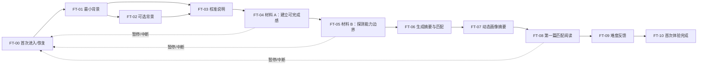

# 首次体验页面状态与埋点清单

> 状态：产品与数据契约草案 v0.1
> 日期：2026-07-15
> 范围：用户从首次进入产品，到完成第一篇匹配阅读并提交难度反馈。本文定义页面状态、事件语义和验收清单，不是视觉稿、路由/API 冻结稿或已经验证的转化结论。

> 终端范围：首次体验和后续学习都只支持电脑浏览器。页面状态、埋点与验收不覆盖手机、平板、原生客户端或跨终端恢复。

32 个事件的 `v1.0.0` JSON Schema 与前后端权威生产责任已经冻结，见[首次体验事件契约与前后端责任矩阵](18-首次体验事件契约与前后端责任矩阵.md)和 [`contracts/analytics/first-experience/v1`](../contracts/analytics/first-experience/v1/README.md)。本文若与机器 Schema 的字段或来源端冲突，以冻结的 Schema 和责任矩阵为准。

## 1. 目标与边界

首次体验要在尽量低的输入负担下完成三件事：

1. 取得英一/英二、目标、时间和可选成绩等最小背景；
2. 用两段短阅读形成带不确定性的初始动态画像；
3. 立即让用户开始一篇匹配阅读，而不是停在测评报告页。

首版目标路径是：

`60–90 秒最小背景 → 8–12 分钟轻量校准 → 自然语言摘要 → 第一篇匹配阅读 → 难度反馈`

时间、材料数量和步骤数量都是待上线数据校准的产品假设。首次体验不得输出精确能力分、预计提分、词汇量或“已掌握”结论；不得出现 Agent、模型、算法、置信区间、工作流和其他技术解释。

## 2. 激活与漏斗口径

| 口径 | 定义 | 用途 |
|---|---|---|
| 首次体验开始 | 首次进入该流程并创建 `flow_run_id` | 漏斗起点 |
| 校准完成 | 两段材料均产生有效提交，或命中明确的合规降级规则 | 判断校准流程能否走通 |
| 核心激活 | 校准后开始第一篇匹配阅读 | 衡量用户是否真正获得首个产品价值 |
| 高质量激活 | 完成第一篇匹配阅读，并提交难度反馈 | 衡量首次匹配是否形成完整闭环 |
| 首次体验完成 | 完成第一篇匹配阅读，并提交或明确跳过难度反馈，随后建立下一任务状态 | 流程终点 |

“查看画像摘要”不单独算激活；“完成注册”也不算。留存按次日、3 日和 7 日回访观察，但只能作为产品健康指标，不能解释为学习效果。

## 3. 页面与状态流

以下路由仅作信息架构占位，实现时可以调整，但状态 ID 和事件语义应保持版本化。

### 3.1 核心页面状态

| 状态 ID | 建议路由 | 用户目标 | 页面必须呈现 | 主操作 | 允许的次操作/出口 |
|---|---|---|---|---|---|
| `FT-00 entry.new` | `/start` | 明白马上能得到什么 | “用两段短阅读找到合适起点”、预计用时、可随时暂停 | 开始 | 隐私说明、退出 |
| `FT-00 entry.resume` | `/start` | 从中断处继续 | 上次停留步骤、已保存说明、预计剩余时间 | 继续 | 重新开始；必须二次确认且不静默删除证据 |
| `FT-01 profile.required` | `/start/profile` | 提供最小必要背景 | 英一/英二、考试日期或备考阶段、目标分、每日可用时间 | 下一步 | 返回；必要字段说明 |
| `FT-02 profile.optional` | `/start/profile` | 提供可选起点信息 | 最近真实成绩及日期、主要困难；明确“可以跳过” | 保存并继续 | 跳过、返回 |
| `FT-03 calibration.intro` | `/calibration` | 理解任务方式 | 两段材料、需要独立完成、会询问信心和证据、可标记熟题 | 开始第一段 | 暂停退出 |
| `FT-04 calibration.material_a` | `/calibration/:session_id` | 在较稳妥材料上留下首次证据 | 完整短材料、问题、证据定位、信心、最小必要提示入口 | 提交本段 | 标记见过/显示异常、暂停 |
| `FT-05 calibration.material_b` | `/calibration/:session_id` | 在边界材料上留下第二组证据 | 与 A 相同的交互骨架；难度可提高一个主要维度 | 提交校准 | 标记见过/显示异常、暂停 |
| `FT-06 calibration.processing` | `/calibration/summary` | 等待可继续的结果 | 非技术性状态文案、保存成功、必要时提供确定性降级 | 查看建议 | 超时后进入保守匹配，不展示供应商或内部错误 |
| `FT-07 summary.ready` | `/calibration/summary` | 知道当前从哪里开始 | 1 项优势、1 项首要问题、不确定性说明、第一篇材料选择原因 | 开始第一篇阅读 | 纠正背景、说明“这不是最终等级” |
| `FT-08 matched_reading.active` | `/context/:task_id` | 完成第一篇正式训练材料 | 材料、任务目标、独立首读与证据处理、保存状态 | 完成阅读任务 | 暂停、报告材料问题；不能先显示完整解析 |
| `FT-09 difficulty_feedback` | `/context/:task_id/complete` | 纠正后续难度 | “太难/合适/太简单”三选一；可选原因标签 | 提交并继续 | 明确跳过本次反馈 |
| `FT-10 first_experience.complete` | `/context` | 明白下一步 | 本次完成内容、仍待确认项、下一篇/下次任务 | 继续语境实验室 | 查看并纠正画像摘要 |

### 3.2 材料页子状态

`FT-04`、`FT-05` 和 `FT-08` 共用以下子状态，前端必须逐一实现和测试：

| 子状态 | 触发 | 页面行为 |
|---|---|---|
| `loading` | 首次取材料或恢复 | 显示结构骨架；不提前泄露答案、重点或内部匹配参数 |
| `reading` | 材料可用 | 允许独立阅读和必要的用户主动标记；不默认弹出解释 |
| `responding` | 用户开始作答 | 本地保护未提交输入；切页或关闭前可恢复 |
| `submitting` | 用户提交 | 防重复提交；按钮进入明确等待状态，保持输入可见 |
| `saved` | 服务端确认 | 显示已保存，并进入下一步；以服务端事件为完成事实 |
| `hinted` | 用户主动请求提示 | 记录提示等级；返回后仍需用户重新作答，不能自动代答 |
| `seen_reported` | 用户报告见过材料 | 当前材料不再计作有效校准证据，替换材料并保留审计记录 |
| `issue_reported` | 用户报告内容异常 | 保存当前进度，切换审核材料或保守路径；不要求重复填写背景 |
| `recoverable_error` | 网络/服务短暂失败 | 使用用户可理解的重试文案；不清空输入，不出现技术错误 |
| `resumed` | 从已保存节点恢复 | 恢复材料、输入和已用提示；明确告诉用户进度已保留 |

### 3.3 决策与降级状态

- 缺少可选成绩：继续校准，不提醒用户资料“不完整”；
- 两段材料之一被标记为熟题：替换该段，不将其计入画像；
- 用户中断：保存到最近一次服务端确认步骤，再次进入时直接恢复；
- 匹配服务不可用：使用经过版本化测试的保守规则选择材料，并说明“先从一篇稳妥材料开始”；
- 证据不足或相互矛盾：摘要只说明“还需要一次新材料确认”，第一篇材料保持主体可理解；
- 连续提交失败：允许保存本地草稿和稍后继续，但不得伪造服务端已保存状态；
- 没有合格权利状态的材料：停止发布该材料，不能因首次体验转化压力绕过内容权利门槛。

## 4. 埋点设计原则

### 4.1 事件信封

所有事件使用 `snake_case`，最小公共字段如下：

| 字段 | 说明 |
|---|---|
| `event_id` | 客户端或服务端生成的唯一 ID，用于幂等去重 |
| `event_name` | 版本化事件名称 |
| `event_schema_version` | 事件属性 schema 版本 |
| `occurred_at` | UTC 事件时间 |
| `source` | `client`、`server` 或 `derived` |
| `anonymous_learner_id` | 与公开身份分离的稳定匿名标识 |
| `session_id` | 本次浏览会话 |
| `flow_run_id` | 一次首次体验流程，可跨会话恢复 |
| `flow_version` | 页面顺序、文案和规则版本 |
| `page_state` | 本文定义的页面/子状态 |
| `app_version` | 用户端构建版本 |
| `device_class` | 固定为 `desktop`，仅为保持 v1 事件信封稳定；不采集或推断具体设备型号，也不用于终端分层 |
| `exam_track` | `english_1`、`english_2`、`unknown` |
| `correlation_id` | 与受保护领域事件/运行追踪关联，不在用户端显示 |

通用分析事件不保存原始答案、作文正文、所选原文跨度、完整提示、最近真实分数、目标院校、IP、精确设备指纹或第三方原始数据。学习内容只保存在受权限控制的业务证据库，分析事件通过 `attempt_id`、`material_version_id` 和 `learner_snapshot_id` 引用。事件流本身仍属于需要保护和可删除的数据，不因匿名 ID 而免除合规要求。

### 4.2 事实来源

- 页面曝光、点击和主动反馈由客户端发出；
- 保存成功、校准完成、画像快照和匹配结果由服务端发出，作为漏斗事实源；
- 不使用 `beforeunload` 直接判断放弃；超过约定窗口仍未推进时由服务端派生 `calibration_stalled`；
- 客户端重发必须复用 `event_id`，服务端命令使用幂等键；
- 分析平台、业务证据库和底层日志分开：分析事件不充当学习证据，日志不充当产品漏斗。

## 5. 事件字典

### 5.1 进入与背景设置

| 事件 | 来源 | 触发时机 | 关键属性 |
|---|---|---|---|
| `first_experience_started` | server | 创建首次体验流程 | `entry_source`, `flow_version` |
| `first_experience_resumed` | server | 恢复未完成流程 | `resume_page_state`, `inactive_hours_band` |
| `profile_step_viewed` | client | 背景步骤可交互 | `step_id`, `required` |
| `profile_step_submitted` | server | 背景字段保存成功 | `step_id`, `provided_field_count`, `optional_field_count` |
| `profile_optional_skipped` | server | 用户跳过可选信息且跳过状态保存成功 | `step_id` |

不得把具体最近成绩、目标分或自由文本困难描述复制到分析属性；只记录字段是否提供。实际值进入学习者领域数据。

### 5.2 校准行为

| 事件 | 来源 | 触发时机 | 关键属性 |
|---|---|---|---|
| `calibration_intro_viewed` | client | 说明页可见 | `estimated_minutes_band` |
| `calibration_started` | server | 创建校准会话 | `calibration_session_id`, `plan_version`, `material_count` |
| `calibration_material_presented` | server | 合格材料成功呈现 | `material_version_id`, `position`, `difficulty_profile_id`, `selection_reason_code` |
| `calibration_response_submitted` | server | 作答保存成功 | `attempt_id`, `material_version_id`, `position`, `response_type`, `active_seconds_band` |
| `calibration_evidence_submitted` | server | 证据定位保存成功 | `attempt_id`, `span_count`, `evidence_status`；不含原文 |
| `calibration_confidence_submitted` | server | 信心选择保存成功 | `attempt_id`, `confidence_band` |
| `calibration_hint_delivered` | server | 提示实际发放 | `attempt_id`, `hint_level`, `hint_type` |
| `calibration_material_flagged` | server | 熟题/异常标记保存成功 | `material_version_id`, `flag_type`, `replacement_issued` |
| `calibration_material_completed` | server | 单段所有必要动作完成 | `material_version_id`, `position`, `attempt_id`, `hint_level_max` |
| `calibration_paused` | server | 用户主动暂停且状态已保存 | `pause_page_state`, `completed_material_count` |
| `calibration_stalled` | derived | 约定窗口未推进 | `last_confirmed_page_state`, `inactive_hours_band` |
| `calibration_completed` | server | 校准满足完成或降级条件 | `calibration_session_id`, `completion_mode`, `valid_material_count` |

### 5.3 画像、匹配与第一篇阅读

| 事件 | 来源 | 触发时机 | 关键属性 |
|---|---|---|---|
| `reading_profile_snapshot_created` | server | 生成可重算的初始画像 | `learner_snapshot_id`, `evidence_count`, `confidence_band`, `snapshot_version` |
| `material_match_decided` | server | 从候选集选定第一篇材料 | `match_decision_id`, `learner_snapshot_id`, `candidate_count`, `selected_material_version_id`, `reason_codes`, `fallback_used` |
| `profile_summary_viewed` | client | 摘要主要内容进入可视区域 | `learner_snapshot_id`, `uncertainty_message_shown` |
| `matched_reading_presented` | server | 第一篇材料可用 | `match_decision_id`, `material_version_id`, `difficulty_profile_id` |
| `matched_reading_started` | server | 用户产生首个有效阅读动作 | `task_id`, `material_version_id`, `match_decision_id`；触发核心激活 |
| `matched_reading_paused` | server | 主动暂停且状态已保存 | `task_id`, `task_state`, `active_seconds_band` |
| `matched_reading_completed` | server | 第一篇正式任务满足完成条件 | `task_id`, `attempt_id`, `hint_level_max`, `completion_mode` |
| `difficulty_feedback_submitted` | server | 难度反馈保存成功 | `task_id`, `rating`, `reason_codes`；`rating` 为 `too_hard/fit/too_easy` |
| `difficulty_feedback_skipped` | server | 用户明确跳过本次反馈 | `task_id`, `skip_surface` |
| `next_match_adjusted` | server | 后续选材因反馈或新证据变化 | `previous_match_decision_id`, `new_match_decision_id`, `adjustment_direction`, `reason_codes` |
| `first_experience_completed` | server | 高质量激活完成并建立下一任务状态 | `flow_run_id`, `elapsed_minutes_band`, `completion_path` |

### 5.4 错误与降级

| 事件 | 来源 | 触发时机 | 关键属性 |
|---|---|---|---|
| `flow_error_shown` | client | 用户实际看到可恢复错误 | `page_state`, `public_error_code`, `retry_available`；不含异常消息 |
| `flow_retry_requested` | client | 用户点击重试 | `page_state`, `public_error_code`, `retry_count_band` |
| `fallback_path_used` | server | 使用确定性保守路径 | `page_state`, `fallback_reason_code`, `fallback_version` |
| `local_draft_recovered` | client | 未提交输入从本地恢复 | `page_state`, `draft_age_minutes_band`；不含草稿内容 |

### 5.5 首批受控枚举

| 字段 | 首批值 |
|---|---|
| `flag_type` | `seen_before`, `content_error`, `display_issue`, `other_selected` |
| `rating` | `too_hard`, `fit`, `too_easy` |
| 难度 `reason_codes` | `vocabulary`, `syntax`, `inference`, `length`, `time_pressure`, `topic`, `instructions`, `other_selected` |
| `completion_mode` | `standard`, `conservative_fallback`, `replacement_material` |
| `fallback_reason_code` | `low_evidence`, `conflicting_evidence`, `match_service_unavailable`, `eligible_pool_empty` |
| `adjustment_direction` | `easier`, `harder`, `same_level_new_dimension` |

枚举增加值需要提升事件 schema 版本或遵守向后兼容规则，不能把任意异常文本、用户自由文本或模型输出塞进 `reason_codes`。

## 6. 首版指标清单

### 6.1 漏斗

1. `first_experience_started`；
2. 必要背景保存成功；
3. `calibration_started`；
4. 材料 A 完成；
5. 材料 B 完成；
6. `calibration_completed`；
7. `profile_summary_viewed`；
8. `matched_reading_started`，即核心激活；
9. `matched_reading_completed`；
10. `difficulty_feedback_submitted`，形成高质量激活；明确跳过则仍可完成首次体验，但不计高质量激活。

每一步必须显示人数、转化率、中位耗时和上一确认状态后的停滞率，并按 `flow_version`、英一/英二和是否提供最近成绩分层。不得按设备类别建立产品决策，也不得用未经审核的敏感背景做营销分群。

### 6.2 匹配质量

- 首篇“太难/合适/太简单”分布；
- 首篇完成率和提示等级；
- 被标记为熟题或内容异常的材料比例；
- 证据不足时使用保守匹配的比例；
- 首篇反馈为过难/过易后，下一篇调整方向正确且被评价为“合适”的比例；
- 同一材料在不同画像切片中的退出和难度反馈异常；
- 前 3–5 次任务中画像变化幅度和用户主动纠正率。

这些指标只能表示流程与匹配表现，不能说明用户能力提升。

### 6.3 时间指标

- 从 `first_experience_started` 到 `calibration_started`；
- 校准有效作答时间与总历时；
- 从 `calibration_completed` 到 `matched_reading_started`；
- 首次价值时间：从流程开始到核心激活；
- 中断后恢复率和恢复后的完成率。

时长使用分桶或服务端派生值，避免为了分析发送高频心跳、鼠标轨迹或逐键输入。

## 7. 控制舱首版看板

控制舱新增“首次体验”区域，至少包含：

1. **激活漏斗**：各页面状态的进入、完成、停滞和耗时，支持按版本与英一/英二分层；
2. **材料匹配质量**：材料难度反馈、首篇完成率、熟题/异常率和纠偏成功率；
3. **流程恢复**：暂停、停滞、恢复、重复提交和本地草稿恢复；
4. **降级与错误**：公开错误码、重试成功率、保守路径使用率及版本变化；
5. **匹配回放**：按匿名用户查看画像快照引用、候选材料、过滤约束、选择理由、反馈和下一次调整；
6. **事件健康**：客户端/服务端事件数量差异、重复事件、延迟到达和 schema 拒绝。

控制舱默认展示聚合数据和匿名 ID。查看原始作答、作文或证据跨度需独立权限、用途说明和访问审计。允许的首版控制仅包括停用问题材料、切换已批准的保守匹配配置和回滚流程版本；不得直接修改学习者数据库状态。

## 8. 页面验收清单

### 8.1 主流程

- [ ] 用户不提供最近成绩也能进入校准；
- [ ] 英一/英二不能根据学硕/专硕自动猜测；
- [ ] 两段材料的任务目标、证据定位和信心输入清晰；
- [ ] 摘要只展示可行动的优势、问题和下一步，不展示内部数值；
- [ ] 摘要主按钮直接进入第一篇匹配阅读；
- [ ] 第一篇材料只在一个主要维度形成明显挑战；
- [ ] 完成后可一键反馈太难/合适/太简单；
- [ ] 核心激活和高质量激活均由服务端事实事件判定。

### 8.2 中断与异常

- [ ] 刷新、返回和关闭后可以从最近确认状态恢复；
- [ ] 连点提交不会产生重复作答或重复事件；
- [ ] 熟题能替换且不污染有效校准证据；
- [ ] 网络失败不清空用户输入；
- [ ] 匹配服务失败时进入保守材料，不暴露技术错误；
- [ ] 没有合法材料时宁可停止，也不绕过权利状态；
- [ ] 低置信度与证据冲突使用自然语言说明仍需确认。

### 8.3 桌面可用性、无障碍与隐私

- [ ] 支持矩阵内的桌面电脑浏览器和桌面视口均能完成主流程；
- [ ] 宽屏并排、窗口缩放和栏宽变化不会丢失阅读位置、选区与草稿；
- [ ] 键盘可操作、焦点顺序正确、状态变化可被辅助技术感知；
- [ ] 颜色不是难度、错误或保存状态的唯一表达；
- [ ] 页面不会在用户作答前泄露答案、重点或完整解析；
- [ ] 用户端不出现模型、token、trace、工作流和内部置信度；
- [ ] 分析事件不包含原始答案、正文、原文跨度和自由文本；
- [ ] 用户删除账号/学习数据时，事件与关联标识按已声明策略处理；
- [ ] 非必要分析同意撤回不影响基础训练。

## 9. 实施顺序

1. 先冻结状态 ID、服务端完成事实和事件 schema；
2. 用静态合法材料完成主流程与断点恢复，不等待自适应算法；
3. 接入保守的多维匹配规则和可回放决策；
4. 建立漏斗、材料质量、错误/降级和事件健康看板；
5. 用合成边界场景验证事件顺序、幂等、缺失字段和恢复路径；
6. 上线后按自然使用数据调整步骤和时间假设，不据此宣称学习效果。
