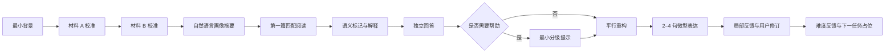

# 首个纵向切片与桌面交互规格

> 状态：Sprint 0 实现基线 v0.1
> 日期：2026-07-15
> 终端：仅电脑浏览器桌面 Web
> 证据边界：只验证工程流程，不验证真人学习效果。

## 1. 切片目标

首个切片不是把整个产品缩小，而是选择一条能够同时暴露核心风险的完整学习路径：

> 用户先读、先标、先解释；系统只给最小必要帮助；用户重新输出，并把阅读中形成的内容带入一段微型表达。全过程可暂停、恢复、审计和回放。

它必须同时验证：

- 冷启动画像与保守匹配；
- 桌面长文阅读和精确语义标记；
- 用户输出优先与 AI 最小介入；
- 读到写的最短迁移；
- 版本化修订和内容归属；
- 幂等、恢复、降级、拒判和控制舱回放。

## 2. 用户路径



### 2.1 完成事实

切片完成必须同时满足：

1. 两段校准材料都产生有效服务端提交，或命中批准的保守降级；
2. 第一篇匹配阅读产生至少一个用户认知证据；
3. 用户在完整答案前完成自己的首次解释；
4. 如使用 AI 帮助，用户随后产生新的亲自输出；
5. 微型表达至少保存初稿；如收到反馈，必须保存用户修订版本；
6. 难度反馈提交或被用户明确跳过；
7. 下一任务占位和审计记录成功建立。

仅浏览材料、查看解析、接受 AI 文本或停留达到时长均不算完成。

## 3. 桌面信息架构

### 3.1 阅读与认知工作区

```text
┌─────────────────────────────────────────────────────────────────────────────┐
│ 阶段 / 当前任务 / 保存状态 / 剩余步骤                         暂停并退出 │
├───────────────────────────────────────────────┬─────────────────────────────┤
│                                               │ 本步任务                    │
│ 阅读材料                                      │ ────────────────────────── │
│                                               │ 当前问题                    │
│ 鼠标选择文本后就近出现语义标记入口            │ 我的解释                    │
│ 标记不改变原文排版，不预先显示 AI 重点         │ 信心 / 提示入口             │
│                                               │                             │
│                                               │ [保存并继续]                │
├───────────────────────────────────────────────┴─────────────────────────────┤
│ 当前标记：观点  证据  逻辑  不确定点  可迁移表达     快捷键帮助 / 无障碍状态 │
└─────────────────────────────────────────────────────────────────────────────┘
```

默认比例假设：材料区 62%，任务区 38%。用户可在 55/45 至 70/30 之间调节；调整只改变呈现，不改变证据语义。

### 3.2 微型表达与修订工作区

```text
┌─────────────────────────────────────────────────────────────────────────────┐
│ 原阅读任务 / 表达目标 / V1 已保存 / AI 贡献：0%              暂停并退出 │
├──────────────────────────────┬──────────────────────────────────────────────┤
│ 可复用内容                    │ 我的作品                                     │
│ - 用户标记的观点              │                                              │
│ - 用户标记的证据              │ 中文、关键词、中英混合或不完整句均可起步     │
│ - 候选表达资源                │ 最终由用户亲自组织为 2–4 句英文              │
│                              │                                              │
│ 不提供完整提纲或成品段落      │                                              │
├──────────────────────────────┼──────────────────────────────────────────────┤
│ 版本与差异                    │ 当前只显示一项最高优先级反馈                  │
│ V1 初稿 → V2 修订             │ [我来修改] [暂不采用] [说明不准确]           │
└──────────────────────────────┴──────────────────────────────────────────────┘
```

## 4. 语义标记基线

首轮实现五类语义，不以五种常驻颜色同时轰炸用户：

| 类型 | 用户意图 | 后续动作 |
|---|---|---|
| `claim` | 这是作者或段落的核心观点 | 要求用自己的话复述 |
| `evidence` | 这段支持某个判断 | 关联到观点或答案 |
| `logic` | 这里发生转折、让步、因果或递进 | 说明两部分关系 |
| `uncertain` | 我不确定词义、句法、指代或推理 | 选择困难类型后进入帮助阶梯 |
| `reusable_expression` | 这段表达可能迁移到写作 | 进入微型表达候选区，但不代表已经会用 |

交互约束：

- 必须先由用户选择文本，系统不得首读前预标；
- 标记保存原文版本、起止位置、片段哈希、语义类型和用户解释；
- 重叠标记必须可区分、可编辑、可删除；
- 标记删除保留审计事件，但用户界面不制造负担；
- `reusable_expression` 只有在用户后续恰当使用并通过延迟验证后才可能升级证据。

## 5. 帮助阶梯

| 等级 | 允许内容 | 禁止内容 |
|---|---|---|
| H0 | 不提供帮助 | — |
| H1 | 重述任务、指出需要检查的维度 | 标出答案所在句 |
| H2 | 提醒局部结构、逻辑关系或词义范围 | 给完整翻译或答案 |
| H3 | 提供一个局部线索或两个候选解释供比较 | 生成完整解释 |
| H4 | 在用户多次失败后给最小示范，并立即要求平行新任务 | 让用户只点确认 |

每次帮助都必须保存等级、原因、版本和后续用户输出引用。H4 完成不计作独立掌握。

## 6. 微型表达任务

首轮只要求 2–4 句，不写完整考研作文。任务必须：

- 使用用户在阅读中已经处理过的一个观点或论证动作；
- 最多推荐一个适合主动表达的词组或句式；
- 允许中文、关键词、中英混合和不完整句起步；
- 禁止一键翻译为完整英文；
- 用户先写 V1，系统才能提供一项最高优先级反馈；
- 用户亲自形成 V2，系统不得直接覆盖原文；
- 保存 V1、反馈、用户动作和 V2 的引用关系。

## 7. 键盘与鼠标基线

以下快捷键是待验证工程假设，必须可发现、可关闭且不覆盖浏览器常用快捷键：

| 动作 | 暂定快捷键 |
|---|---|
| 保存草稿 | `Ctrl/Cmd + S` |
| 撤销/重做 | 系统标准 `Ctrl/Cmd + Z`、`Shift + Ctrl/Cmd + Z` |
| 打开标记菜单 | 选择文本后 `Alt/Option + M` |
| 标记“不确定” | `Alt/Option + U` |
| 在材料区与任务区切换 | `Alt/Option + 1`、`Alt/Option + 2` |
| 打开快捷键帮助 | `?`，仅在非输入状态 |

必须验证中文输入法组合态期间任何快捷键都不会提交、保存半成品或破坏选区。

## 8. 状态与恢复

| 状态 | 服务端事实 | 本地责任 |
|---|---|---|
| `reading` | 材料版本和任务已呈现 | 阅读位置可本地恢复 |
| `drafting` | 最近一次已确认草稿版本 | 保存尚未提交的输入，不伪造服务端成功 |
| `submitting` | 幂等命令处理中 | 禁止重复按钮动作，允许安全重试 |
| `saved` | 服务端产生不可变版本 | 清理对应本地临时草稿 |
| `hinted` | 提示实际发放 | 恢复已用提示等级 |
| `revision_required` | 反馈和目标版本已确认 | 保持光标与差异上下文 |
| `review_pending` | 自动结果被拒判并进入复核 | 提供确定性可继续任务 |
| `paused` | checkpoint 已保存 | 下次进入直接恢复 |
| `recoverable_error` | 操作未完成 | 不清空输入，展示公开错误码 |

## 9. 公开错误码基线

| 错误码 | 用户可见含义 | 系统动作 |
|---|---|---|
| `TEMPORARY_UNAVAILABLE` | 当前步骤暂时不可用，可以重试 | 有限重试或保守路径 |
| `SAVE_NOT_CONFIRMED` | 内容尚未确认保存 | 保留本地草稿，复用幂等键 |
| `MATERIAL_REPLACED` | 当前材料需要更换 | 保留已完成背景，不计入有效证据 |
| `CONTENT_NOT_ELIGIBLE` | 暂时没有可用材料 | 权利门阻断，不绕过 |
| `FEEDBACK_NEEDS_REVIEW` | 这次反馈需要复核 | 不更新高影响状态 |
| `BUDGET_LIMIT_REACHED` | 本次先使用基础训练路径 | 停止远程调用，执行确定性降级 |
| `SESSION_CONFLICT` | 任务状态已经变化，请重新载入 | 返回最新版本，不覆盖新状态 |

用户端不得展示模型名、供应商、工作流节点、trace、token、异常堆栈或数据库信息。

## 10. 控制舱最小视图

控制舱只需要四个页面：

1. 运行列表：状态、耗时、成本、版本、公开错误码；
2. 运行回放：节点、输入输出摘要、状态差异、重试与 checkpoint；
3. 复核队列：拒判原因、证据引用、批准/驳回与理由；
4. 审计记录：操作者、命令、理由、预期版本、前后状态。

默认不展示完整作文和原始正文；查看受保护内容必须显式进入受审计流程。

## 11. 验收场景

### 正常路径

- 无最近成绩的用户仍可完成校准；
- 用户标记证据、解释并完成微型表达 V1/V2；
- 所有服务端完成事实只产生一次；
- 用户端不出现内部技术术语；
- 控制舱能够回放完整引用链。

### 边界路径

- 材料被标为见过后正确替换；
- 中文输入法组合态不触发快捷键或自动提交；
- 重叠标记、撤销重做和 200% 缩放可用；
- 刷新、关闭、网络断开后恢复到最近确认状态；
- 重复提交、乱序事件和旧版本写入被安全处理。

### 故障路径

- 模型超时、非法 JSON、无引用反馈和预算超限均进入降级；
- Worker 在每个节点后退出，重启后不重复副作用；
- 内容权利变为不可用后，新会话不能再呈现；
- 控制舱越权、缺少理由或版本冲突的命令被拒绝；
- 删除演练能够处理业务数据、对象、事件关联和第三方引用。

## 12. 切片完成标准

- 所有状态与领域对象通过机器契约验证；
- 合法内容包可以完整驱动正常路径；
- Chrome、Edge、WebKit 桌面项目通过主路径；
- Firefox 完成兼容冒烟；
- 键盘、焦点、缩放和中文输入法专项通过；
- 正常、边界、恶意输入和故障场景全部有自动化证据；
- 运行成本、延迟、重试和拒判可在控制舱观察；
- 不宣称真人可用性、学习效果或评分效度。
