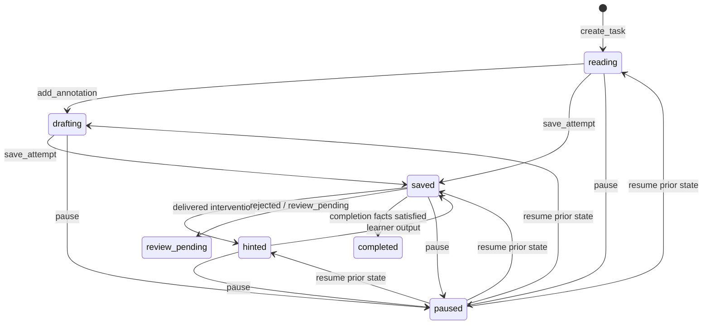

# 首个纵向切片领域实现记录

> 状态：任务级领域增量 v0.1；跨任务后续见文档 28
> 日期：2026-07-16
> 证据边界：只证明合成数据下的领域规则、事务和 API 契约可运行，不证明学习效果。

## 1. 本次实现的纵向边界

本增量打通了一个最小但完整的业务链：

`建立任务 → 保存用户 V1 → 发放分级最小提示/局部反馈 → 保存用户 V2 → 建立修订引用 → 完成任务 → 控制舱回放`

同时覆盖无需提示的独立完成、材料见过后的替换、暂停恢复、内容撤回阻断、重复命令和旧版本写入冲突。

本次没有实现通用聊天入口，也没有让领域层调用模型。模型/确定性适配器只允许在领域外生成候选结果，再以版本化命令登记为一次 `AiIntervention`。

## 2. 领域对象与职责

| 对象 | 性质 | 责任 |
|---|---|---|
| `LearningTask` | 聚合根 | 执行状态转换、版本检查和完成条件 |
| `LearnerProfileSnapshot` | 不可变快照 | 固定本任务使用的目标、时间、语言背景和显式偏好 |
| `MaterialAssignment` | 追加事实 | 固定内容版本、哈希、权利状态和分配原因 |
| `MaterialInvalidation` | 追加事实 | 记录见过/撤回，不删除原分配和历史证据 |
| `Annotation` | 追加事实 | 保存语义类型、精确文本范围、哈希和用户解释 |
| `Attempt` | 追加事实 | 保存学习者亲自输出的 V1/V2…和独立性归因 |
| `AiIntervention` | 追加事实 | 保存输入版本、H1–H4、类型、适配器和提示词版本 |
| `RevisionEvent` | 追加事实 | 建立 V1、介入和用户 V2 之间的引用链 |
| `DomainEvent` | 追加事实 | 驱动审计、Outbox 和控制舱回放 |

`learning_tasks.state` 是可重建的当前投影；作答、介入、修订、材料失效和领域事件均只追加。

## 3. 已编码的不变量

1. 新任务只能使用权利状态为 `eligible_dev`、`eligible_pilot` 或 `eligible_release` 的版本化材料；
2. 标记必须引用当前内容版本，范围长度、文本和 SHA-256 必须一致；
3. 第一次输出必须是 `independent`，且任何 AI 介入之前必须已经存在学习者输出；
4. H1/H2 后的新输出记为 `hinted_low`，H3/H4 后记为 `hinted_high`；
5. 一次已发放介入后，用户未产生新输出前不能再次介入，也不能完成任务；
6. 微型表达收到 `priority_feedback` 后，必须保存用户 V2 和 `RevisionEvent` 才能完成；
7. V1 不被 V2 覆盖，修订必须引用更高版本的学习者输出；
8. 见过或撤回的材料通过失效事实和新分配替换，原分配、作答和审计不删除；
9. 完成后的任务不可再变更，暂停任务必须先恢复；
10. 每个写命令同时检查 `Idempotency-Key` 和 `expected_version`。

## 4. 状态与命令

状态机是纯 Python 领域代码，不依赖 FastAPI、SQLAlchemy、LangGraph、编辑器或模型供应商。后续工作流框架只能编排领域命令，不能绕过聚合根直接更新状态。

## 5. 事务与幂等语义

一次成功写入在同一 PostgreSQL 事务内完成：

1. 对 `Idempotency-Key` 取得事务级 advisory lock；
2. 命中相同命令和请求哈希时返回原业务事实；
3. 以 `expected_version` 更新任务投影；
4. 追加新领域事实和 `domain_events`；
5. 追加不含原始作文/正文的 `audit_events`；
6. 追加待 Worker 消费的 `outbox_messages`；
7. 记录幂等结果引用并提交。

同一幂等键携带不同请求或命令时返回 `SESSION_CONFLICT`。旧版本写入也返回当前版本，不覆盖已经确认的事实。

## 6. API 边界

学习端 API 已具备：

- `GET /learner/v1/tasks/{task_id}`
- `POST /learner/v1/tasks/{task_id}/annotations`
- `POST /learner/v1/tasks/{task_id}/attempts`
- `POST /learner/v1/tasks/{task_id}/revisions`
- `POST /learner/v1/tasks/{task_id}/material-seen`
- `POST /learner/v1/tasks/{task_id}/pause`
- `POST /learner/v1/tasks/{task_id}/resume`
- `POST /learner/v1/tasks/{task_id}/complete`

学习端不再提供独立任务创建入口。任务必须由 `POST /learner/v1/runs` 建立运行后，随阶段推进原子分配，避免客户端绕过校准和材料匹配。

控制 API 已具备受角色保护的介入登记和回放：

- `POST /control/v1/tasks/{task_id}/interventions`
- `GET /control/v1/tasks/{task_id}/replay`

学习 API 不返回模型适配器、提示词版本或内部事件。控制舱回放默认只显示哈希、版本和引用摘要，不返回完整学习者作文文本。

## 7. 自动化证据

当前自动化覆盖固定场景中的以下语义：

| 场景 | 自动化证据 |
|---|---|
| 04 独立完成 | 无提示完成时最高提示级别保持 H0 |
| 05 H2 修订 | V1 保留，H2 引用 V1，V2 为 `hinted_low`，修订链完整 |
| 06 材料见过 | 原分配保留，追加失效和替换事件 |
| 08 重复命令 | 相同幂等键只产生一个作答版本 |
| 18 内容撤回 | 恢复被阻断，已保存用户输出不丢失 |
| 19 控制命令守卫 | 独立角色、理由和预期版本边界 |

测试层包括纯领域单元/属性测试、真实 PostgreSQL 仓储与 API 集成测试、原有机器契约和安全边界测试。

## 8. 后续增量状态

以下原定下一增量已经在[跨任务运行编排与保守匹配实现记录](28-跨任务运行编排与保守匹配实现记录.md)中实现：两段校准、匹配阅读、微型表达、难度反馈、下一任务占位和整条切片完成判定。当前匹配器只使用学习者快照、两次校准的提示依赖/输出独立性和显式内容特征，是保守、确定性、可回放的 Spike 启发式，不是局部知识状态模型或 IRT/CAT 能力估计。

仍未完成：

- Worker 消费 Outbox、模型网关、超时/预算降级和故障注入；
- 桌面阅读工作区、语义标记编辑器、自动保存、差异视图和 IME；
- 基于词汇、词组、语法结构和反复错误假设的局部知识状态匹配；
- 真人、教师、内容权利、材料难度和学习效果验证。

下一增量应优先进入桌面标记/输出工作区，并让前端只消费已冻结的运行与任务 API，避免临时界面逻辑反向定义领域规则。
