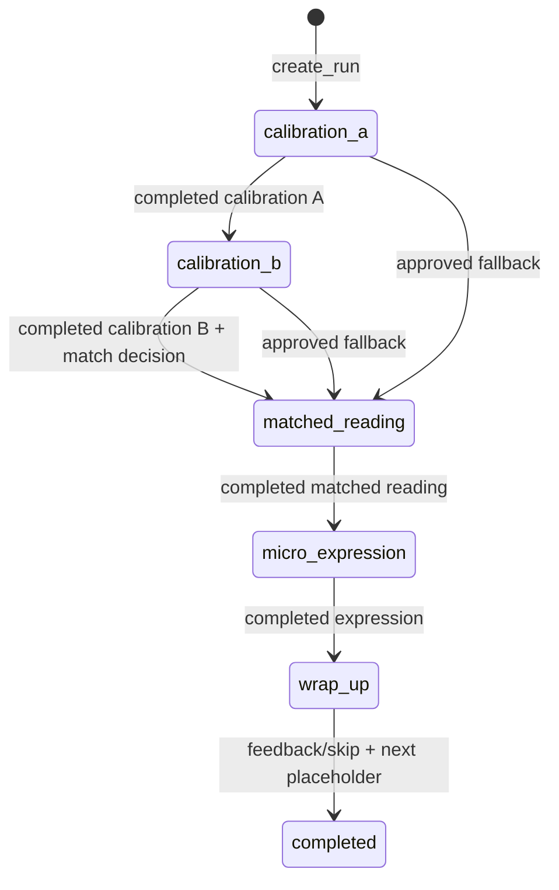

# 跨任务运行编排与保守匹配实现记录

> 状态：首个纵向切片后端领域闭环 v0.2
>
> 日期：2026-07-16
>
> 证据边界：证明合成内容和本地 PostgreSQL 下的阶段、不变量、事务、幂等及回放可运行；不证明材料难度匹配、能力估计或学习效果有效。

## 1. 本次交付结果

本增量在任务级 `LearningTask` 之上增加 `VerticalSliceRun` 聚合根，打通以下固定路径：

`校准 A → 校准 B → 匹配阅读 → 微型表达 → 收尾反馈 → 下一任务占位 → 运行完成`

后台 Agent 在这里表现为受领域规则约束的任务编排器，不是聊天入口。学习端只能创建运行，不能直接创建任意任务；每个下一任务必须由当前任务的已完成事实和运行阶段共同触发，并与运行更新在同一事务中落库。

## 2. 阶段状态机

每次 `advance` 必须同时满足：

1. 提交的任务就是当前运行任务；
2. 任务聚合已经处于 `completed`；
3. `expected_version` 与运行当前版本一致；
4. 下一阶段的任务类型和内容版本完整；
5. 进入匹配阅读时必须附带同版本的 `MatchDecision`；
6. 任务创建、运行更新、事实、领域事件、审计、Outbox 和幂等记录原子提交。

校准只能因 `content_unavailable` 或 `technical_recovery` 由开发者控制角色显式跳过。降级事实、匹配决定和新任务分配均追加记录，不能静默改道。

## 3. 保守材料匹配 v1

`conservative_match_v1` 是确定性、可解释、可回放的 Spike 策略。

输入包括：

- 冻结的学习者画像：英一/英二、会话时长、自报水平、已有证据数；
- 最多两次已完成校准：最高提示级别和最后一次输出的独立性；
- 内容候选特征：适用试卷、主题熟悉度、预计时长、词汇/句法负荷、证据距离和内容版本。

策略规则：

- 自报 `weak/unknown`、证据少于 2、校准不足两次或出现 H3/H4 依赖时，优先熟悉主题和较低综合负荷；
- 自报 `steady`、至少两条画像证据且两次校准均 H0 独立完成时，允许选择中等主题新颖度；
- 先过滤不兼容的英一/英二材料，再按会话时长、熟悉度和综合负荷确定性排序；内容版本 ID 作为稳定决胜项。

每次决定保存候选版本、选中版本、策略版本、是否保守和理由码。它明确不做以下事情：

- 不估计考试总分或潜在能力参数；
- 不宣称材料难度已标定；
- 不使用 IRT/CAT 选题或更新能力；
- 不根据一两次表现写入“已掌握”；
- 不替代后续词汇、词组、语法结构和错误假设的局部知识状态模型。

## 4. 聚合与事实边界

| 对象 | 责任 |
|---|---|
| `VerticalSliceRun` | 阶段推进、当前任务、完成条件和版本冲突 |
| `RunTaskRef` | 追加任务分配，固定角色、类型和内容版本 |
| `run_task_completion_events` | 独立保存任务完成版本和最高提示级别 |
| `MatchDecision` | 固定候选集、选中版本、策略版本和理由 |
| `difficulty_feedback_events` | 保存 `too_easy/matched/too_hard` 或显式跳过 |
| `NextTaskPlaceholder` | 在结束前给出下一任务类型和安排理由 |

`workflow_runs` 只保存可重建的当前投影。任务分配、完成、匹配、反馈、领域事件和审计记录均采用追加事实，避免用覆盖式状态丢失决策依据。

运行完成必须同时满足：两次校准或已审批降级、匹配阅读完成、微型表达完成、难度反馈或显式跳过、下一任务占位存在，并且运行处于 `wrap_up`。

## 5. API 边界

学习端运行 API：

- `POST /learner/v1/runs`
- `GET /learner/v1/runs/{workflow_run_id}`
- `POST /learner/v1/runs/{workflow_run_id}/advance`
- `POST /learner/v1/runs/{workflow_run_id}/difficulty-feedback`
- `POST /learner/v1/runs/{workflow_run_id}/next-task-placeholder`
- `POST /learner/v1/runs/{workflow_run_id}/complete`

控制端运行 API：

- `POST /control/v1/runs/{workflow_run_id}/calibration-fallback`
- `GET /control/v1/runs/{workflow_run_id}/replay`

任务级读取、标记、作答、修订、暂停恢复和完成 API 继续存在，但 `POST /learner/v1/tasks` 已移除。运行回放只返回版本、哈希、引用、理由和事件摘要，不返回学习者原始作文。

## 6. PostgreSQL 与迁移

迁移 `0003_vertical_slice_run`：

- 扩展 `workflow_runs` 的画像、阶段、降级、难度反馈和下一任务投影；
- 新增 `run_task_refs`、`run_task_completion_events`；
- 新增 `material_match_decisions`、`difficulty_feedback_events`、`next_task_placeholders`。

本地已实际完成 `head → base → head` 往返迁移，并在重建后的 schema 上运行全部集成测试。旧的任务级内部夹具仍可建立兼容运行投影，但公开学习端不能绕过运行编排创建任务。

## 7. 自动化证据

当前测试覆盖：

- 完整四任务运行、难度反馈、下一任务占位和最终完成；
- 错误当前任务、缺失匹配决定和旧版本推进被拒绝；
- 相同幂等键重复推进只返回原结果，不创建第二个任务；
- 低证据/高提示依赖选择熟悉材料；
- 两次 H0 独立校准允许中等主题新颖度；
- 校准降级必须显式审批并产生审计事件；
- 精确文本范围标记仍绑定被分配的内容版本；
- 运行回放不泄露学习者原始输出；
- 公开独立任务创建入口保持关闭。

这些测试是工程证据，不是测量效度、教学效果或真人可用性证据。

## 8. 下一纵向增量

H0 桌面学习工作区已在[桌面学习工作区实现记录](29-桌面学习工作区实现记录.md)中落地，包括安全内容快照、精确语义标记、独立输出、版本化本地草稿、暂停恢复和收尾进步证据。下一步是实现受审计的最小提示/反馈通道及 V1/V2 差异，而不是继续扩张页面功能。匹配策略在真人校准前保持保守启发式；IRT/CAT 与局部知识状态只能在题目参数、样本量和效度门槛成立后接入，不能提前包装为能力分数。
