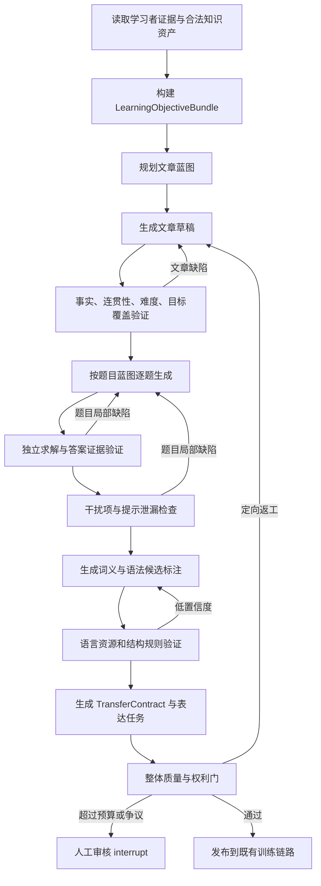
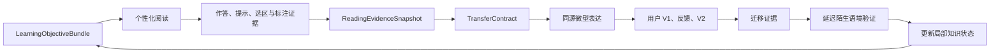
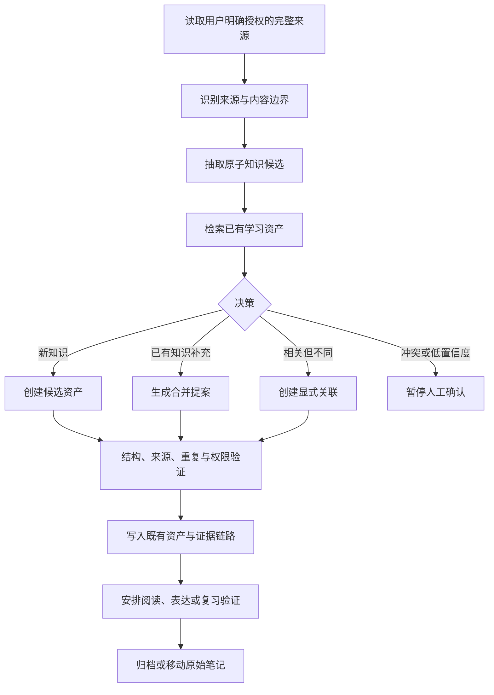

# Agent 内容质量、知识整理与双实验室闭环升级基线

> 状态：升级设计基线 v0.3；P2 受控工程闭环已实施，正式质量路径仍受决策门阻断  
> 日期：2026-07-25  
> 适用范围：知识整理、个性化阅读、文章与题目生成、标注辅助、语境实验室与表达实验室衔接、Agent 工作流运行时  
> 证据边界：本文根据当前仓库代码和既有产品文档记录已确认的实现事实、缺口、目标契约与验收门槛。本文不是完成声明；模型自评、Schema 通过、原文子串命中和合成测试均不能单独证明语言分析正确或学习有效。

## 1. 文档目的

当前系统的主要问题不是模型能力不足或 Prompt 不够长，而是把多阶段、可验证、需要恢复和返工的教学任务压缩成了若干次“一次模型调用返回完整 JSON”。这会造成四类直接后果：

1. 内容生成缺少教学目标、局部质量诊断和定向返工；
2. 题目、语法和词义解释只有结构稳定性，没有足够的语义稳定性；
3. 语境实验室与表达实验室在界面和运行阶段上相邻，但个性化材料缺少真正的教学迁移关系；
4. 知识整理只完成分类和移动，没有完成知识提炼、去重、关联、冲突处理和可复用资产化。

本文用于约束后续升级，防止只增加框架、Prompt、模型重试或新的平行页面，却不解决教学目标、证据、质量和状态连续性问题。

## 2. 决策摘要

后续改造冻结以下原则：

1. **保留既有用户旅程。** 新能力必须进入现有 `matched_reading → micro_expression → wrap_up` 运行链路，不新建一套平行的“智能阅读/智能表达”流程。
2. **先定义共同教学契约，再生成各类产物。** 文章、题目、词义、语法、提示和表达任务必须引用同一组教学目标与原文证据。
3. **质量驱动的定向返工取代整包盲目重试。** 质量报告必须指出失败组件、缺陷代码、证据和允许的修复动作，只重做失败部分。
4. **模型不是唯一验证器。** 字符区间、答案唯一性、提示泄漏、词典义项、句法结构、内容谱系和状态推进必须尽可能由确定性规则、外部语言资源或独立求解器验证。
5. **允许系统承认不确定。** 低置信度语法分析和词义消歧必须降级、请求复核或明确拒答，不能用流畅文本掩盖证据不足。
6. **框架服从领域状态机。** LangGraph 承载动态分支、循环、检查点和人工介入；PydanticAI 约束节点内模型输入输出和工具调用；DBOS 只承载固定步骤的耐久任务。同一业务状态机不同时套两套耐久运行时。
7. **知识整理必须产出知识变化，而不是文件位置变化。** 移动原始笔记只能是最后一步，且必须在提炼、关联、冲突检查和人工确认之后。

## 3. 当前实现事实与问题定性

本节记录立项时的历史基线，用于说明为什么需要升级；已完成的门禁、契约、工作流
Spike 和剩余发布阻断项以第 14 节及
`docs/49-Agent升级决策门台账.md` 的最新状态为准。

### 3.1 个性化阅读和题目

当前个性化阅读适配器主要生成标题、正文段落、关注点和来源标题。教学目标、题目蓝图、答案证据、提示、词义义项、语法结构和表达迁移任务没有在同一生成契约中形成。

`services/api/binnagent_api/personalized_reading_content.py` 中：

- 每个个性化阅读项只装配一个 `reading_question`；
- 题目是固定主旨题模板；
- A 选项被固定为正确答案；
- 选项、解释和提示主要是通用文本，不是经过独立求解和干扰项验证的文章题目；
- `grammar_challenge` 选择一个单词并交换字母，实际是词形/拼写辨认，不是句法分析。

因此，当前个性化阅读不能被描述为“根据文章稳定生成分层题目和语法训练”。

### 3.2 通用文章与材料包生成

`python/binnagent_agent/workflows/content_generation.py` 已经具备结构化输出、生成—审核—修订循环和整包校验，这是可复用的基础；但当前粒度仍然过粗：

- 一次生成调用同时产生文章、题目、语法挑战和迁移表达；
- 审核失败后主要重做完整候选，不能稳定保留已经通过的组件；
- 问题库校验侧重题型和数量覆盖；
- 证据校验主要确认引文是原文子串；
- 尚未独立证明答案唯一、干扰项合理、提示不泄漏、难度与学习目标匹配；
- 模型评分达到阈值不等于完成了人工一致性、语言学正确性或真人效度验证。

因此，现有流程应被视为“结构化材料生成和初步模型审核”，不能作为发布级内容质量的最终证明。

### 3.3 标注辅助、语法分析和词义解释

当前标注分析网关已经约束输出 Schema、选区范围和原文证据引用，但它主要验证“结果格式正确且引用了原文”，没有充分验证“解释本身正确”。

当前缺失包括：

- 词形还原、稳定词性识别和词典候选义项召回；
- 基于上下文的候选义项排序与可靠置信度；
- 搭配、依存关系和篇章语境证据；
- 句法解析器或可比较的第二分析结果；
- 主句、从句、谓语、连接词、修饰范围的结构一致性校验；
- 翻译与语法跨度对齐；
- 低置信度拒答和版本化缓存；
- 面向真实错误的金标准评测集。

当前仓库没有可直接承担这些验证的完整词典义项源和句法解析器。这是基础设施缺口，不能通过改写 Prompt 宣称已经解决。

### 3.4 双实验室衔接

现有运行聚合已经提供：

`matched_reading → micro_expression → wrap_up`

这条状态机应继续作为唯一学习主路径。

但 `python/binnagent_domain/vertical_slice/matching.py` 的表达材料匹配主要依赖静态内容的来源 ID。个性化阅读使用的内容 ID 与静态表达候选谱系不一致时，会进入 `source_link_unavailable_fallback`。此时：

- 表达任务不一定来自刚读完的文章；
- 阅读中的错题、提示使用、选词、困难句和标注结果没有成为表达任务输入；
- 表达结果也没有回流验证本次阅读目标；
- 集成测试能证明阶段从阅读推进到表达，但不能证明两者具有教学关联。

因此，当前双实验室是“流程顺序连续”，尚不是“学习证据连续”。

### 3.5 知识整理 Agent

当前 Obsidian Inbox 整理链路主要完成：

`读取有限摘要 → 判断分类 → 映射文件夹 → rename`

代码事实如下：

| 当前环节 | 已实现行为 | 证据 | 能证明什么 | 不能证明什么 |
|---|---|---|---|---|
| 插件采集 | 读取允许范围内的 Markdown，生成标题、标签、推断类别和摘要 | `integrations/obsidian-binnagentx/src/main.ts` 的 `collectEntriesAsync` | 已限制同步范围并能取得笔记摘要 | 已读取足够完整的知识上下文 |
| 输入长度 | 插件默认摘要约 900 字符，API 字段上限 1200 字符 | `main.ts` 的 `maxExcerptCharacters`；`learning_asset_routes.py` 的 `ObsidianContextEntry.excerpt` | 请求大小有边界 | 长笔记、表格、引用、后半部分结论和跨段关系没有丢失 |
| 模型决策 | `InboxClassificationOutput` 只返回 `context_id + kind` | `python/binnagent_agent/agents/obsidian_inbox_organizer.py` | 每篇笔记可被分到六种粗类别之一 | 已抽取知识、识别重复或判断掌握 |
| 服务端计划 | 将六种类别映射到四个固定目录，计划只包含来源、目标目录、类别和原因 | `services/api/binnagent_api/obsidian_organizer.py` | 移动计划受白名单约束 | 目标文档结构、合并内容和知识关系已规划 |
| 插件执行 | 校验来源和目标后执行 `vault.rename`，冲突时换名 | `main.ts` 的 `applyOrganizationPlan` | 文件移动可回执、失败可重试 | 笔记内容被整理、原始来源可恢复或冲突已解决 |
| 运行状态 | `queued / planned / noop / completed`，计划保存在 JSONB | `obsidian_organizer_runs` | 分类移动任务有基本幂等和状态记录 | 多阶段知识提炼可暂停恢复，或每个知识变更都有独立审计 |

现有实现还有两个必须正视的语义问题：

1. 同一篇笔记可能包含多个词义、搭配、语法结构和写作技巧，但当前只能得到一个粗类别；
2. 当前导入会先形成或更新 `learning_asset_index`，分类计划随后再修改 `asset_kind`。这容易让“被同步的一篇笔记”“一个可学习的知识单元”和“已经得到验证的学习资产”在产品语义上混为一谈。

它没有完成：

- 从原始材料抽取原子知识；
- 区分词义、搭配、语法、论证动作、例句、错误假设和来源证据；
- 检索已有知识资产并决定新建、合并或关联；
- 发现同义、重复、冲突和过期内容；
- 保存结构化来源、置信度和待验证状态；
- 将知识资产连接到后续阅读、表达和复习。

因此，“换一个位置”不是知识整理完成，只能算收件箱归档动作。后续产品状态和界面文案必须区分：

```text
已同步 ≠ 已分类 ≠ 已提炼 ≠ 已确认 ≠ 已验证掌握
```

## 4. 根因：缺少共同目标、证据和可恢复工作流

上述问题来自同一个结构性缺口：

```text
模型返回 JSON
    ↓
检查字段存在
    ↓
保存或展示
```

该模式只能提高接口稳定性，不能建立教学可靠性。真正需要的是：

```text
明确教学目标
    ↓
生成一个局部产物
    ↓
收集可复核证据
    ↓
执行确定性检查和独立验证
    ↓
按缺陷类型定向返工
    ↓
通过质量门或暂停人工审核
    ↓
把学习表现回写到同一目标
```

这要求系统把“内容对象”升级为“有目标、有来源、有证据、有质量状态、有迁移去向的版本化教学资产”。

## 5. 共同领域契约

### 5.1 `LearningObjectiveBundle`

每次个性化内容生产必须先生成并冻结一个教学目标包，至少包含：

| 字段 | 含义 |
|---|---|
| `objective_bundle_id` | 本轮教学目标包 ID |
| `learner_id` | 学习者边界 |
| `source_asset_ids` | 允许使用的学习资产及版本 |
| `target_word_senses` | lemma、词性、目标义项、搭配和来源证据 |
| `target_grammar_structures` | 目标句法结构及当前薄弱证据 |
| `target_discourse_moves` | 转折、因果、让步、举例、论证等篇章动作 |
| `reading_skill_targets` | 主旨、细节、推断、证据边界等 |
| `difficulty_constraints` | 词汇、句法、篇章和预计时间约束 |
| `required_evidence` | 每项目标在内容中必须出现的可定位证据 |
| `uncertainty` | 目标选择的不确定性和禁止过度推断项 |
| `version` | 契约版本 |

目标包冻结后，文章、题目、标注和表达任务只能引用或明确申请修改，不能在各自生成过程中悄悄换目标。

### 5.2 `ContentArtifact`

文章、题目、提示、标注和表达任务均作为独立版本化产物保存：

```text
ContentArtifact
├─ artifact_id / version
├─ objective_bundle_id
├─ artifact_type
├─ generation_inputs_hash
├─ content_hash
├─ source_spans
├─ quality_status
├─ quality_report_ids
├─ producer_version
└─ supersedes_artifact_id
```

这样可以只替换失败题目或失败标注，不必重生成整篇文章。

### 5.3 `QualityReport`

质量报告必须是机器可路由的事实，不是只有自然语言评分：

| 字段 | 含义 |
|---|---|
| `artifact_id` | 被检查产物 |
| `validator_id/version` | 验证器及版本 |
| `result` | `pass / revise / reject / review_required` |
| `issue_code` | 稳定缺陷代码 |
| `severity` | 严重程度 |
| `evidence_refs` | 原文跨度、求解记录或规则结果 |
| `repair_scope` | 允许修改的字段或组件 |
| `confidence` | 验证置信度 |

首批缺陷代码至少包括：

```text
ARTICLE_COHERENCE_FAILED
ARTICLE_TARGET_COVERAGE_FAILED
QUESTION_NOT_ANSWERABLE
MULTIPLE_VALID_OPTIONS
ANSWER_EVIDENCE_MISMATCH
DISTRACTOR_NOT_PLAUSIBLE
HINT_LEAKS_ANSWER
GRAMMAR_SPAN_INVALID
GRAMMAR_PARSE_LOW_CONFIDENCE
WORD_SENSE_UNRESOLVED
TRANSLATION_ALIGNMENT_FAILED
TRANSFER_TASK_UNRELATED
SOURCE_LINEAGE_MISSING
RIGHTS_STATUS_BLOCKED
```

### 5.4 `ReadingEvidenceSnapshot`

阅读过程中必须追加保存：

- 各题作答、修改和最终答案；
- 使用过的 H1–H4 提示；
- 选中的词、句和证据区间；
- 请求过的词义、语法和逻辑分析；
- 用户对分析结果的有用/错误反馈；
- 困难点及其置信度；
- 本次是否独立完成；
- 关联的 `objective_bundle_id` 和内容版本。

它是表达任务生成和后续复习的输入，不直接等同于“已经掌握”。

### 5.5 `TransferContract`

每篇进入正式训练的个性化阅读必须存在迁移契约：

| 字段 | 含义 |
|---|---|
| `transfer_contract_id` | 迁移契约 ID |
| `objective_bundle_id` | 与阅读共享的目标包 |
| `source_reading_artifact_id` | 唯一来源阅读版本 |
| `required_transfer_targets` | 必须迁移的词义、结构或篇章动作 |
| `reading_evidence_refs` | 决定表达任务的阅读证据 |
| `novel_context_constraints` | 新语境要求，防止照抄 |
| `success_criteria` | 表达成功的可观察标准 |
| `delayed_validation_plan` | 陌生语境下的延迟验证安排 |

没有有效迁移契约的个性化阅读不得静默进入一个无关表达任务；系统应阻断、降级为明确标识的通用练习，或进入人工处理。

### 5.6 `KnowledgeSourceRecord`

知识整理必须先保存不可变来源记录，再创建可编辑知识资产：

| 字段 | 含义 |
|---|---|
| `source_record_id` | 来源记录 ID |
| `learner_id` | 学习者隔离边界 |
| `provider/connection_id` | Obsidian Provider 与授权连接 |
| `source_key` | 原始相对路径 |
| `content_hash` | 本次读取内容哈希 |
| `source_modified_at` | 来源修改时间 |
| `authorized_scope` | 本次允许读取的文件夹/标签范围 |
| `captured_content_ref` | 可审计的受控内容引用，不把任意 Vault 暴露给 Agent |
| `supersedes_source_record_id` | 同一笔记上一版本 |
| `captured_at` | 捕获时间 |

来源记录与知识资产分离。源笔记后来被移动、重命名或修改时，已经发生的抽取决策仍然可以按原版本回放。

### 5.7 `AtomicKnowledgeCandidate`

一篇来源笔记可产生零个、一个或多个原子知识候选：

| 字段 | 含义 |
|---|---|
| `candidate_id` | 候选 ID |
| `source_record_id` | 来源版本 |
| `knowledge_kind` | 词义、搭配、语法、阅读技能、表达技能、错误假设、例证等 |
| `canonical_key` | 用于检索和去重的规范键 |
| `title` | 面向用户的短标题 |
| `claim` | 单一、可验证的知识陈述 |
| `source_spans` | 支撑该陈述的准确原文区间 |
| `examples` | 与来源绑定的例句或用法 |
| `conditions` | 适用范围、语域、句法或考试条件 |
| `confidence` | 抽取置信度 |
| `validation_status` | `candidate / confirmed / rejected / needs_review` |
| `extractor_version` | 抽取器版本 |

一个候选只能表达一个主要知识主张。无法给出原文证据、适用条件或可靠规范键时，不得自动创建正式知识资产。

### 5.8 `KnowledgeChangeProposal`

抽取候选检索已有资产后，只能产生以下显式提案：

```text
CREATE
MERGE
LINK
SUPERSEDE
MARK_CONFLICT
DISCARD
DEFER
```

提案至少包含：

- 候选和已有资产版本；
- 相似度检索结果只是证据，不是最终决策；
- 建议动作及字段级差异；
- 会新增、保留、替换和删除的内容；
- 来源跨度；
- 冲突点和置信度；
- 是否需要人工确认；
- 应进入阅读、表达还是复习验证；
- 幂等键和预期资产版本。

`MERGE` 和 `SUPERSEDE` 不能直接覆盖用户维护的 Obsidian 正文。必须先展示差异，并通过现有业务 API、版本检查、审计和 Outbox 提交。

### 5.9 `KnowledgeRelation`

知识不是文件夹树。首批关系至少包括：

| 关系 | 示例 |
|---|---|
| `SENSE_OF` | 某语境义属于 lemma |
| `COLLOCATES_WITH` | `pose` 与 `a threat` |
| `REALIZES_GRAMMAR` | 例句体现让步从句 |
| `SUPPORTS_READING_SKILL` | 连接词证据支持篇章转折识别 |
| `SUPPORTS_EXPRESSION_SKILL` | 论证动作可用于微型表达 |
| `CONTRADICTS` | 两条笔记对用法限制表述冲突 |
| `EXAMPLE_OF` | 原句是某知识的来源例证 |
| `DERIVED_FROM` | 知识候选来自某来源记录 |
| `REQUIRES` | 掌握该表达前需要某语法基础 |
| `VALIDATED_BY` | 某次独立作答验证了知识 |

关系必须是版本化、可追溯事实。目录位置和标签只用于浏览，不能取代关系。

## 6. 目标工作流

### 6.1 个性化文章与内容包



工作流不得把已通过组件和失败组件一起无差别重做。每个节点必须具备：

- 稳定输入哈希；
- 幂等键；
- 节点版本；
- 最大尝试次数和模型预算；
- 成功、定向返工、人工审核和终止四类结果；
- 可从检查点恢复的最小状态。

### 6.2 质量驱动的受约束 ReAct

本文中的 ReAct 不是让模型无限自由思考，而是：

`观察质量报告 → 选择允许的修复动作 → 调用指定工具 → 重新验证`

约束如下：

1. Agent 只能选择质量报告允许的 `repair_scope`；
2. 每种缺陷有固定可调用工具和最大循环次数；
3. 不把隐藏思维链写入业务数据库；
4. 只保存结构化行动计划、工具调用、证据、产物差异和结果；
5. 达到次数、成本或置信度门槛后必须暂停人工审核，不能无限循环；
6. 有外部副作用的节点必须在中断和恢复后保持幂等。

### 6.3 题目生成与验证

题目不是文章生成的附属字段。每道题至少经过以下步骤：

1. 从目标包选择题目目标、题型、认知操作和难度；
2. 指定准确的原文证据跨度和预期推理路径；
3. 生成题干、正确答案和干扰项；
4. 由不知道标准答案的独立求解器作答；
5. 检查正确答案是否唯一；
6. 为每个干扰项标注错误机制，例如主体偷换、范围扩大、因果倒置、过度推断或原文无据；
7. 生成 H1–H4，并验证 H1/H2 不泄露答案、H3/H4 仍要求用户输出；
8. 只返工失败题目；
9. 用人工金标准集和真实作答数据校准难度，不用模型自评分代替。

正式发布前，题目至少满足：

- 答案可由文章和允许的背景规则推出；
- 证据跨度精确且版本一致；
- 独立求解结果与答案一致；
- 不存在第二个同样合理的选项；
- 每个干扰项均有可解释错误机制；
- 提示梯度通过答案泄漏检查；
- 题目目标能回溯到 `objective_bundle_id`。

### 6.4 语法分析稳定化

语法分析采用混合管线：

1. 冻结用户选区、所属句子、段落、字符偏移和内容哈希；
2. 执行确定性分句、分词和偏移完整性检查；
3. 由句法解析器和/或模型生成结构候选；
4. 输出类型化结构：主句成分、从句跨度/类型/功能、谓语、连接词、修饰范围、歧义和置信度；
5. 验证有限动词覆盖、连接词一致性、跨度合法性和翻译对齐；
6. 低置信度时调用独立验证器或替代分析；
7. 结果仍冲突时明确返回不确定，不生成伪确定解释；
8. 使用 `content_hash + selected_span + analyzer_version` 缓存和回放。

需要新增或选型的基础设施：

- 句法解析器；
- 句子与 token 偏移对齐器；
- 语法结构规则验证器；
- 版本化语言分析缓存；
- 语法金标准样本及人工复核流程。

### 6.5 词义解释稳定化

词义解释采用：

`lemma/POS/形态 → 词典候选义项召回 → 上下文排序 → 搭配/句法证据 → 置信度与拒答`

每次解释至少保存：

- 原词形、lemma 和词性；
- 选中的候选义项 ID 和词典版本；
- 当前上下文中的释义；
- 支持该义项的搭配、依存或篇章证据；
- 被排除的主要候选及原因；
- 置信度和不确定性；
- 原文跨度与内容版本。

如果没有可靠候选义项，系统应展示候选解释和不确定性，不能生成一个没有来源的确定答案。

### 6.6 双实验室学习闭环



后续实现必须保证：

- 表达任务引用同一个 `objective_bundle_id`；
- 表达任务引用刚完成阅读的内容版本；
- 至少一个表达要求来自本次阅读目标或阅读困难证据；
- 新语境不能只允许复制原文；
- 表达反馈引用用户真实输出和同一迁移目标；
- 只有延迟验证或足够独立证据才能提高掌握置信度；
- 个性化内容不再进入 `source_link_unavailable_fallback` 后假装完成了精准迁移。

### 6.7 知识整理工作流

知识整理应扩展现有 Obsidian/学习资产链路：



原始笔记移动必须是最后的可选动作。系统不得把文件夹分类结果直接当作新的知识资产或掌握证据。

#### 6.7.1 运行状态

知识整理运行至少需要以下状态：

```text
queued
→ source_captured
→ candidates_extracted
→ matches_retrieved
→ proposals_ready
→ awaiting_review
→ committing
→ scheduled_for_validation
→ completed
```

并允许进入：

```text
needs_more_context
conflicted
partially_completed
failed
cancelled
```

状态必须记录到现有整理运行聚合的演进版本或其最接近的既有领域扩展中，不得为“智能整理”另建平行工作区。每个节点保存输入哈希、产物版本和已执行副作用，支持进程重启后恢复。

#### 6.7.2 全文读取与授权

完整知识提炼不能继续依赖固定 900/1200 字符摘要，但也不能默认读取整个 Vault：

1. 用户在 Obsidian 插件中继续维护允许文件夹和标签；
2. 服务端先从同步索引发现待处理笔记；
3. 仅对本次运行需要且仍在授权范围内的具体笔记请求完整内容；
4. 插件回传内容哈希、版本和正文，服务端校验与索引版本一致；
5. 笔记内的 Prompt、命令和链接文本全部视为不可信数据；
6. 附件、嵌入、外链和跨笔记读取需要单独授权规则；
7. 内容超限时按稳定段落边界分块，并保留全局字符偏移和重叠区；
8. 处理完成后按数据保留策略保存受控引用，不扩大 Agent 的文件系统权限。

#### 6.7.3 抽取规则

抽取器不得只给整篇笔记贴一个标签。它必须：

- 允许一篇笔记抽取多个不同类型候选；
- 保留每个候选的准确来源跨度；
- 区分原文事实、用户观点、模型推断和待验证假设；
- 对词汇保存 lemma、词性、语境义和搭配；
- 对语法保存结构跨度、功能和例句；
- 对阅读/表达技能保存触发条件、操作步骤和失败模式；
- 对错误记录保存错误证据和正确解释，不能把一次错误直接固化为长期画像；
- 对只有标题、清单或上下文不足的笔记返回 `needs_more_context`；
- 不因为“看起来有用”而脱离来源自动扩写大量新知识。

#### 6.7.4 检索、去重和合并

检索必须同时使用：

- 规范键精确匹配；
- lemma、词性、义项和结构字段匹配；
- 全文或向量相似召回；
- 来源谱系；
- 当前有效版本和已废弃版本；
- 学习者隔离条件。

决策矩阵：

| 情况 | 动作 | 自动化边界 |
|---|---|---|
| 无相似资产且证据完整 | `CREATE` | 可自动创建候选；正式确认取决于风险和置信度 |
| 同一知识、来源提供新例句 | `MERGE` | 可自动追加来源关系；修改正文需版本检查 |
| 主题相关但主张不同 | `LINK` | 可自动建立低风险关系，保留解释 |
| 新来源修正旧知识 | `SUPERSEDE` | 必须人工确认 |
| 两条主张冲突 | `MARK_CONFLICT` | 禁止自动覆盖，进入审核 |
| 无证据、噪声或重复副本 | `DISCARD` | 只丢弃候选，不删除原始笔记 |
| 上下文不足 | `DEFER` | 保留状态并说明需要什么 |

向量相似度只能用于召回，不能直接决定合并。

#### 6.7.5 人工确认

以下动作必须暂停：

- 覆盖或删除用户原文；
- 合并两个已有正式知识资产；
- 改变知识主张或适用条件；
- 处理相互矛盾的来源；
- 从用户私有笔记推断敏感画像；
- 置信度低但会进入个性化训练；
- 批量移动、重命名或修改多个文件。

审核界面应展示“原文证据—现有资产—建议变更”的三方差异，而不是只给一个“同意整理”按钮。拒绝提案不得删除来源或阻止以后重新分析。

#### 6.7.6 提交和 Obsidian 写回

提交顺序必须是：

1. 以 `expected_version` 校验学习资产；
2. 原子写入资产变更、来源关系、知识关系、审计和 Outbox；
3. 将候选标记为已处理；
4. 安排阅读、表达或复习验证；
5. 插件收到已提交计划后才更新 frontmatter、创建链接或移动原始文件；
6. 插件回执后将文件操作标记完成。

如果 Obsidian 写回失败，数据库中的知识提交不能被伪装成文件写回成功；应保留 `sync_pending/sync_failed` 并安全重试。文件移动失败也不得回滚已经确认的来源证据。

#### 6.7.7 与学习闭环连接

知识整理输出不是终点：

- 新词义和搭配进入 `LearningObjectiveBundle` 候选；
- 新语法结构进入语境再遇和句法识别任务；
- 阅读技能进入题目蓝图；
- 表达技能进入 `TransferContract`；
- 错误假设进入待验证队列；
- 只有在后续独立作答、表达或延迟验证中获得证据，才更新 `evidence_status`；
- 未验证资产可以参与内容候选召回，但必须携带不确定性，不能作为“已掌握”依据。

#### 6.7.8 对用户可见的结果

一次整理完成后，用户应看到：

- 处理了哪些来源版本；
- 抽取了哪些原子知识；
- 哪些是新建、合并、关联、冲突、丢弃或延期；
- 每个决定引用的原文；
- 哪些变更等待确认；
- 哪些知识已经安排到后续阅读、表达或复习；
- 原始笔记是否移动、写回失败能否重试。

只显示“已移动 8 篇笔记”不得作为知识整理的成功结果。

## 7. 运行时和框架边界

### 7.1 LangGraph

以下工作流适合使用 LangGraph：

- 个性化文章与内容包生产；
- 质量报告驱动的定向返工；
- 阅读证据到表达迁移的动态编排；
- 知识整理中的新建/合并/关联/冲突分支；
- 低置信度和高风险内容的人工介入；
- 需要在进程重启后恢复的长任务。

运行要求：

- PostgreSQL checkpointer；
- 以现有 `workflow_run_id`、`generation_run_id` 或知识整理运行 ID 作为 `thread_id`；
- 节点状态与长期学习者状态分离；
- `interrupt()` 前后的副作用具备幂等性；
- 恢复时重新执行节点不得造成重复发布、重复扣费或重复写证据；
- 保留 time travel 用于开发调试，不允许绕过正式业务审计直接修改学习事实。

### 7.2 PydanticAI

PydanticAI 用于节点内部：

- 类型化输入输出；
- 工具参数和返回值校验；
- 模型错误分类；
- 可测试的依赖注入；
- 供应商模型适配；
- 把模型建议限制在明确领域契约内。

Schema 通过只表示结构有效，不能取代本文定义的语义验证器。

### 7.3 DBOS

DBOS 适合固定、耐久、步骤可预先定义的后台任务，例如：

- 批量导入与导出；
- 定时同步；
- 固定顺序的离线报告；
- 无动态教学分支的批处理；
- 需要 exactly-once 风格业务事务协调的简单任务。

动态内容质量状态机不再同时由 DBOS 和 LangGraph双重托管。跨边界只通过明确命令、事件、Outbox 和幂等键协作。

### 7.4 复用现有基础设施

改造必须复用：

- `VerticalSliceRun` 的进入、推进、完成和版本冲突链路；
- PostgreSQL 业务事实、Outbox、审计和幂等语义；
- 现有受约束模型网关、预算、超时和 Trace；
- H1–H4 用户帮助与用户亲自形成 V2 的产品约束；
- 现有内容权利状态和发布门；
- 现有学习资产与 Obsidian Provider 边界。

不得新建平行运行表、平行学习首页、平行表达入口或绕过现有任务完成门。

## 8. 稳定性的定义

“稳定”拆为五类，后续验收不得混用：

| 稳定性 | 定义 | 典型验证 |
|---|---|---|
| 运行稳定性 | 重启、超时、重试后能正确恢复 | 故障注入、幂等与恢复测试 |
| 结构稳定性 | 输出满足 Schema 和字段约束 | Pydantic/JSON Schema |
| 引用稳定性 | 证据能映射到正确内容版本和跨度 | 哈希、偏移、来源验证 |
| 语义稳定性 | 答案、语法、词义和解释在允许标准下正确 | 金标准集、独立求解器、语言资源、人工一致性 |
| 教学稳定性 | 相同证据规则产生一致干预，且能促进独立迁移 | 轨迹评测、真人实验、延迟验证 |

当前系统已具备部分运行、结构和引用稳定性；语义稳定性和教学稳定性仍是主要缺口。

## 9. 失败和人工介入策略

按四级处理：

1. **可预期业务结果**：材料不满足目标、义项无法消歧等，返回结构化状态并选择替代路径；
2. **瞬时系统错误**：网络、限流和临时服务异常，按幂等策略有限重试；
3. **可修复模型输出**：Schema 或局部质量失败，进入指定修复节点；
4. **未知、高风险或持续失败**：记录全部已知状态并暂停人工审核。

人工审核至少覆盖：

- 多个答案均合理；
- 事实或权利状态有争议；
- 语法解析器和模型持续冲突；
- 词典无可靠候选义项；
- 合并知识资产可能覆盖用户原文；
- 超过模型成本、尝试次数或时限；
- 发布到真人训练前的抽样复核。

## 10. 迁移顺序

### P0：停止伪能力继续扩散

1. 个性化阅读不再把字母交换题标记为语法训练；
2. 固定 A 正确的单题模板不得进入正式训练；
3. UI 和数据状态区分“结构已生成”与“语义已审核”；
4. 个性化阅读若无迁移契约，不得标记为阅读—表达精准闭环；
5. 现有知识整理结果只标记为“已分类/待提炼”，不得标记为“知识已整理”。

### P1：冻结契约和评测样本

1. 定义 `LearningObjectiveBundle`；
2. 定义 `ContentArtifact` 与版本谱系；
3. 定义 `QualityReport` 和缺陷代码；
4. 定义 `ReadingEvidenceSnapshot`；
5. 定义 `TransferContract`；
6. 建立题目、语法、词义和双实验室连续性的首批金标准样本。

### P2：重建个性化内容工作流

1. 在现有生成运行上接入 LangGraph 检查点；
2. 拆分文章、逐题、提示、标注和表达任务节点；
3. 接入独立求解、答案唯一性和提示泄漏检查；
4. 实现局部产物版本和定向返工；
5. 接入人工 `interrupt/resume`；
6. 通过后仍进入现有 `matched_reading` 阶段。

### P3：稳定语言分析

1. 选型并接入可授权使用的词典/词库；
2. 选型句法解析器；
3. 实现偏移、结构和翻译对齐验证；
4. 实现低置信度拒答；
5. 建立版本化缓存；
6. 用人工样本评测，不以模型互评作为唯一门槛。

### P4：打通双实验室迁移

1. 阅读开始时绑定迁移契约；
2. 收集阅读过程证据；
3. 基于目标和困难动态生成同源表达任务；
4. 将表达 V1/V2 作为迁移证据；
5. 安排陌生语境延迟验证；
6. 只有满足证据门槛才更新局部知识状态。

### P5：升级知识整理

1. 保留现有 Inbox 同步和移动能力，但把它降级命名为 `InboxArchiver`；
2. 扩展现有整理运行状态，加入来源捕获、抽取、检索、提案、审核、提交和验证调度；
3. 增加按笔记授权的全文读取协议、内容哈希和来源版本；
4. 从单标签分类器升级为多候选原子知识抽取器；
5. 定义 `KnowledgeSourceRecord`、`AtomicKnowledgeCandidate`、`KnowledgeChangeProposal` 和 `KnowledgeRelation` 契约；
6. 接入已有资产的规范键、结构字段、全文/向量召回和版本检索；
7. 实现 `CREATE / MERGE / LINK / SUPERSEDE / MARK_CONFLICT / DISCARD / DEFER` 决策；
8. 对覆盖、冲突、批量写回和低置信度训练输入执行人工 `interrupt/resume`；
9. 通过现有学习资产、证据、审计和 Outbox 链路提交，不直接由模型改文件；
10. 将确认后的知识送入阅读目标、表达迁移或复习验证；
11. 最后才由插件更新 frontmatter、创建关系链接、移动或归档原始笔记；
12. 迁移完成后删除“分类完成即知识整理完成”的旧产品语义，但保留旧运行回放。

## 11. 验收标准

### 11.1 长任务与恢复

- 在任意模型节点后杀死 Worker，恢复后从已提交检查点继续；
- 已完成模型调用不因恢复被重复计费或重复发布；
- 同一幂等键不会创建重复题目、表达任务或知识资产；
- 达到重试和成本上限后进入可见审核状态；
- 人工恢复使用相同 `thread_id`，并保留完整审计。

### 11.2 文章和题目

- 每篇文章有冻结的目标包和目标覆盖报告；
- 每道题有独立证据跨度、求解记录和干扰项错误机制；
- 独立求解器与标准答案一致；
- 多答案检测失败时不会发布；
- H1/H2 不直接泄露答案；
- 修复一道题不会改变已通过文章和其他题目；
- 整体审核失败能定位到具体产物和缺陷代码。

### 11.3 语法和词义

- 相同内容、选区和分析器版本返回相同缓存结果；
- 所有结构标签映射到有效原文跨度；
- 低置信度和验证冲突会明确拒答或转人工；
- 词义结果引用具体词典义项和版本；
- 语法、词义金标准集达到另行冻结的准确率和一致性门槛；
- 更新模型或解析器后执行回归评测，不静默覆盖旧结果。

### 11.4 双实验室

- 每个个性化阅读存在 `transfer_contract_id`；
- 表达任务与阅读引用同一 `objective_bundle_id`；
- 表达任务至少使用一个目标或阅读困难证据；
- 个性化内容不再出现无说明的 `source_link_unavailable_fallback`；
- 表达反馈能追溯到阅读来源和用户 V1/V2；
- 延迟陌生语境验证之前不把一次成功写成稳定掌握。

### 11.5 知识整理

- 一篇包含多类内容的笔记可产生多个原子知识候选；
- 每个候选包含来源版本、内容哈希和准确原文跨度；
- 短摘要不足时会请求授权全文或返回 `needs_more_context`，不会据摘要编造完整知识；
- 每个新知识资产可追溯到授权来源和准确证据；
- 相同来源版本和抽取器版本重复运行不会产生重复候选；
- 相同提案幂等重放不会重复创建资产、关系或 Outbox 消息；
- 重复内容产生合并提案，不重复建档，向量相似不会直接触发合并；
- 合并提案展示字段级差异并使用 `expected_version`；
- 冲突内容进入 `MARK_CONFLICT`，不会自动覆盖；
- 用户拒绝提案后原始笔记和已有资产均保持不变；
- Worker 在抽取、检索、等待审核或提交后中断均可恢复；
- 数据库提交成功、Obsidian 写回失败时保留可重试同步状态；
- 原始笔记移动前已经有可审计、可回放的处理记录；
- 新资产能够进入既有阅读、表达或复习调度；
- 新资产在独立学习证据出现前保持未验证状态；
- 文件夹变化本身不会更新学习掌握状态。

## 12. 非目标与禁止事项

本轮升级不做：

- 多个自由对话 Agent 互相讨论后直接发布；
- 用更大模型替代验证体系；
- 用增加温度、重复采样或多数投票冒充事实正确；
- 保存或展示模型隐藏思维链；
- 绕过用户亲自作答和修订的教学原则；
- 用合成数据宣布学习效果；
- 另建平行的阅读、表达、知识库或工作流控制面；
- 自动运行、重建或修改 OpenWiki。

## 13. 关联文档与代码入口

产品与架构基线：

- `docs/13-Agent与IRT-CAT技术路线.md`
- `docs/14-双实验室产品定位与竞争力分析.md`
- `docs/28-跨任务运行编排与保守匹配实现记录.md`
- `docs/30-H1最小帮助与V2闭环实现记录.md`
- `docs/31-微型表达单项反馈与V2闭环实现记录.md`
- `docs/32-受约束模型网关与确定性降级实现记录.md`
- `docs/40-核心Agent辅助与材料编排实现记录.md`
- `docs/42-tools设计.md`
- `docs/43-Obsidian的MCP接入.md`
- `docs/45-Obsidian作为Agent记忆模块.md`

当前关键代码入口：

- `services/api/binnagent_api/personalized_material_service.py`
- `services/api/binnagent_api/personalized_package.py`
- `services/api/binnagent_api/personalized_content_review_routes.py`
- `services/api/binnagent_api/personalized_reading_content.py`
- `services/api/binnagent_api/model_adapters.py`
- `services/api/binnagent_api/vertical_slice/routes.py`
- `services/api/binnagent_api/vertical_slice/run_routes.py`
- `python/binnagent_agent/workflows/content_generation.py`
- `python/binnagent_agent/workflows/personalized_content_graph.py`
- `python/binnagent_agent/gateways/model.py`
- `python/binnagent_domain/vertical_slice/matching.py`
- `python/binnagent_agent/agents/obsidian_inbox_organizer.py`
- `services/api/binnagent_api/obsidian_organizer.py`
- `services/api/binnagent_api/knowledge_organization_service.py`
- `services/api/binnagent_api/knowledge_organization_routes.py`
- `python/binnagent_agent/workflows/knowledge_organization_graph.py`
- `integrations/obsidian-binnagentx/src/main.ts`

运行时参考：

- [LangGraph persistence](https://docs.langchain.com/oss/python/langgraph/persistence)
- [LangGraph interrupts](https://docs.langchain.com/oss/python/langgraph/interrupts)
- [PydanticAI DBOS durable execution](https://pydantic.dev/docs/ai/capabilities/durable_execution/dbos/)

## 14. 后续决策门

决策进度与关闭条件统一记录在 `docs/49-Agent升级决策门台账.md`。截至
2026-07-25，已经形成：

1. ADR-0006：LangGraph 作为动态 Agent 工作流首选运行时进入受控 Spike；
2. ADR-0009：PostgreSQL 业务表继续作为唯一业务事实源，现有 Worker/Outbox 负责投递与领取，checkpoint 只负责执行恢复；
3. ADR-0011：OEWN + `wn`、spaCy 和 Stanza 进入同契约离线候选对照，尚未
   冻结为产品 Provider；
4. 已完成 P0/P1/P3/P4 工程基线和 P5 受控工程接线、LangGraph 双图、完整节点
   边界故障矩阵、跨进程恢复、图版本保护、checkpoint 审计/清理工具及本地容量基线；
5. P2 已完成受控工程接线：新个性化材料经目标、文章、逐题、语法、迁移、质量门
   和人工 `interrupt/resume` 后，进入原有 `matched_reading → micro_expression`
   链路；未审核材料保持阻断；
6. P5 已通过现有控制审核、学习资产、Outbox 和 Obsidian 版本补丁协议跑通
   `CREATE / MERGE` 真实 PostgreSQL 闭环，并为七种知识动作冻结显式结果；
7. 生产正式发布、真实 Provider 跑分、专家金标、正式审核 SLA、真实环境旧数据
   迁移，以及真实 Vault 长断线/人工编辑冲突演练仍保持显式未关闭状态。

受控工程闭环通过只证明执行、恢复、证据和门禁成立。在剩余决策冻结之前，不得把
fixture、开发者人工验收、候选框架或模型互评结果描述为已经满足正式发布质量。
